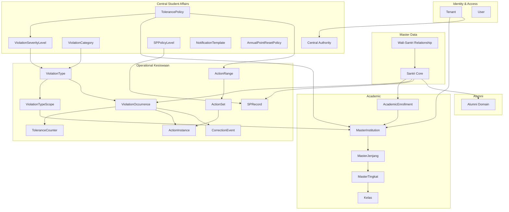

# WP-303 — Central Student Affairs / Kesiswaan
## Domain Architecture Baseline v2.0
## APP MA'HAD Enterprise Education ERP

| Metadata | Value |
|----------|-------|
| **Document** | WP-303 Central Student Affairs Domain Architecture |
| **Version** | 2.0 |
| **Status** | ARCHITECTURE BASELINE READY — PENDING PRODUCT OWNER APPROVAL |
| **Classification** | Enterprise Domain Layer — CRITICAL |
| **Date** | 2026-08-26 |
| **Author** | Principal Solution Architect |
| **Supersedes** | WP-303 v1.0 (2026-08-24) |
| **Decision Source** | [WP-303 Decision Consolidation OBD-01-11](file:///C:/Users/Thinkpad%20X1%20Carbon/.gemini/antigravity-ide/brain/fc192bcb-dadc-481e-83c5-48dc8ecd45d3/WP-303-Decision-Consolidation-OBD-01-11.md) |
| **Validation** | [WP-303 Decision Validation Report](file:///C:/Users/Thinkpad%20X1%20Carbon/.gemini/antigravity-ide/brain/fc192bcb-dadc-481e-83c5-48dc8ecd45d3/WP-303-Decision-Validation-Report.md) |
| **Governance Rule** | NO CODE / NO MIGRATION / NO RUNTIME CHANGE |

---

## Table of Contents

1. [Executive Summary](#1-executive-summary)
2. [Re-Baseline Changelog](#2-re-baseline-changelog)
3. [Canonical Domain Model](#3-canonical-domain-model)
4. [Tenant & Academic Structure](#4-tenant--academic-structure)
5. [Multi-Academic Enrollment](#5-multi-academic-enrollment)
6. [Central Student Affairs](#6-central-student-affairs)
7. [Institution Student Affairs](#7-institution-student-affairs)
8. [Violation Domain](#8-violation-domain)
9. [Violation Severity](#9-violation-severity)
10. [Point Awarding](#10-point-awarding)
11. [Tolerance Model](#11-tolerance-model)
12. [Tolerance Counter](#12-tolerance-counter)
13. [Tolerance Policy Configuration](#13-tolerance-policy-configuration)
14. [Tolerance Quota & Boundary](#14-tolerance-quota--boundary)
15. [Tolerance Recap / History View](#15-tolerance-recap--history-view)
16. [Discipline Action Engine](#16-discipline-action-engine)
17. [Action Set & Action Instance](#17-action-set--action-instance)
18. [Correction & Reversal](#18-correction--reversal)
19. [SP Policy](#19-sp-policy)
20. [Annual Transition](#20-annual-transition)
21. [Mid-Year Acceleration](#21-mid-year-acceleration)
22. [Notification Policy](#22-notification-policy)
23. [Student Lifecycle Integration](#23-student-lifecycle-integration)
24. [Student 360 View](#24-student-360-view)
25. [Parent / Wali Visibility](#25-parent--wali-visibility)
26. [Policy Versioning & Historical Integrity](#26-policy-versioning--historical-integrity)
27. [RBAC & Security Boundaries](#27-rbac--security-boundaries)
28. [Security Threat Scenarios](#28-security-threat-scenarios)
29. [Student Exit & Alumni Boundary](#29-student-exit--alumni-boundary)
30. [Alumni Portal Roadmap (Future / Out-of-Scope)](#30-alumni-portal-roadmap-future--out-of-scope)
31. [Domain Separation](#31-domain-separation)
32. [State Machines](#32-state-machines)
33. [Domain Relationships](#33-domain-relationships)
34. [Canonical Invariants](#34-canonical-invariants)
35. [Architecture Gaps](#35-architecture-gaps)
36. [Business Decisions Register](#36-business-decisions-register)
37. [Remaining Open Decisions](#37-remaining-open-decisions)
38. [Implementation Dependencies & Work Packages](#38-implementation-dependencies--work-packages)
39. [Canonical Terminology](#39-canonical-terminology)
40. [Implementation Readiness Gate](#40-implementation-readiness-gate)

---

## 1. Executive Summary

This document is the **Single Source of Truth** for the Central Student Affairs (Kesiswaan) domain of the APP MA'HAD Enterprise Education ERP. Version 2.0 incorporates all Product Owner decisions (OBD-01 through OBD-11) and supersedes all v1.0 assumptions that conflict with these decisions.

### Critical Changes from v1.0

| Change | v1.0 | v2.0 (THIS DOCUMENT) |
|---|---|---|
| **Tolerance metric** | Undecided / implied accumulated point value | **OCCURRENCE COUNT** (OBD-01) |
| **Tolerance scope** | Per-violation-type or per-severity | **Severity + Academic Scope** — shared counter (OBD-01) |
| **Tolerance ceiling → quota** | Point value threshold | **Occurrence count** quota (OBD-01/OBD-10) |
| **Student academic model** | Single institution context | **Multi-Academic Enrollment** (OBD-11) |
| **Violation scope** | Single `ranahInstansi` | **Multiple Academic Scopes** per Master Violation (OBD-11) |
| **Annual reset** | Undecided | **Annual Transition** resets tolerance; Official Point has separate reset policy (OBD-02) |
| **Correction cascading** | Undecided | **REQUIRED** — reversed violation withdraws Official Points (NEW DECISION) |
| **Annual Point Reset scope** | Undecided | **Per Tenant** (NEW DECISION) |
| **Alumni boundary** | Not addressed | **Defined** — minimal handoff, no dump (NEW) |

---

## 2. Re-Baseline Changelog

| Section | Change Type | Description |
|---|---|---|
| §3 | **REWRITTEN** | Canonical Domain Model updated with multi-enrollment, multi-scope violations |
| §4 | **REWRITTEN** | Academic owns Educational Structure; replaced MasterInstitution proposal |
| §5 | **NEW** | Multi-Academic Enrollment section |
| §8 | **REWRITTEN** | ViolationOccurrence model: `tolerance_count_at_recording` replaces `accumulated_value_at_recording` |
| §10 | **REWRITTEN** | Point Awarding: tolerance check is occurrence-based |
| §11 | **NEW** | Tolerance Model — OCCURRENCE COUNT canonical definition |
| §12 | **RENAMED & REWRITTEN** | Was "Accumulated Violation Value" → now "Tolerance Counter" with occurrence semantics |
| §13 | **REWRITTEN** | Tolerance Policy: metric fixed; Academic Scope dimension added |
| §14 | **RENAMED & REWRITTEN** | Was "Tolerance Ceiling" → now "Tolerance Quota & Boundary" |
| §15 | **NEW** | Tolerance Recap / History View |
| §16 | **REWRITTEN** | Action Range operates on occurrence count; OBD-03/04/05/06 rules |
| §18 | **REWRITTEN** | Correction: OBD-08 + correction cascading |
| §19 | **UPDATED** | SP Policy: dependency on Official Point clarified |
| §20 | **NEW** | Annual Transition (OBD-02/OBD-07) |
| §21 | **NEW** | Mid-Year Acceleration (OBD-07) |
| §29-30 | **NEW** | Student Exit & Alumni Boundary; Alumni Portal Roadmap |
| §31 | **NEW** | Domain Separation |
| §34 | **REPLACED** | 24 canonical invariants replace old INV-SA-01 through INV-SA-24 |
| §36 | **UPDATED** | OBD-01 through OBD-11 marked DECIDED |
| §40 | **UPDATED** | Implementation Readiness Gate |

---

## 3. Canonical Domain Model

### 3.1 Tenant Structure

```
TENANT (e.g. "Pesantren Al-Fatih")
│
├── Academic A (e.g. "Madrasah Umum / Depag")
│   └── Educational Structure A
│       ├── Jenjang A1, A2, ...
│       ├── Tingkat A1.1, A1.2, ...
│       └── Kelas A1.1a, A1.1b, ...
│
├── Academic B (e.g. "Madrasah Diniyah / Madin")
│   └── Educational Structure B
│       ├── Jenjang B1, B2, ...
│       ├── Tingkat B1.1, B1.2, ...
│       └── Kelas B1.1a, ...
│
├── Academic C (e.g. "Madrasatul Qur'an / Madqur")
│   └── Educational Structure C
│       └── ...
│
├── Students
│   └── Multiple Academic Enrollments
│       ├── Enrollment in Academic A → Tsanawiyah 2
│       ├── Enrollment in Academic B → Diniyah 4
│       └── Enrollment in Academic C → Qur'an 3
│
├── CENTRAL STUDENT AFFAIRS (tenant-wide governance)
│   ├── Severity Levels (configurable)
│   ├── Violation Masters (multi-scope)
│   ├── Tolerance Policies (per Severity + Academic Scope)
│   ├── Action Ranges + Action Sets
│   ├── SP Policy
│   ├── Notification Policy
│   └── Annual Point Reset Policy
│
└── Alumni (optional domain)
    └── Alumni Portal (subscription-dependent)
```

### 3.2 Key Rules

- Tenant MAY have 1..N Academics/Institutions — not restricted to fixed types
- Each Academic owns its own Educational Structure
- Central Student Affairs is tenant-level governance — NOT an Academic itself
- Alumni is a separate domain with minimal handoff from Student lifecycle

---

## 4. Tenant & Academic Structure

### 4.1 Academic/Institution as Owner of Educational Structure

**CANONICAL RULE (OBD-11)**:

Academic/Institution is the **OWNER** of Educational Structure.

Educational Structure consists of:
- **Jenjang** — hierarchical grouping (e.g., Tsanawiyah, Aliyah)
- **Tingkat** — progression step within a jenjang (e.g., Kelas 1, 2, 3)
- **Kelas** — specific class instance

Central Student Affairs does **NOT** own or duplicate Educational Structure.

### 4.2 Current vs Target

| Aspect | Current | Target |
|---|---|---|
| Institution registry | Hardcoded `Instansi = 'madin' | 'madqur' | 'depag'` | Data-driven `MasterInstitution` per tenant |
| Institution count | Implicitly 3 | 1..N configurable |
| Educational Structure | `masterJenjang` + `masterTingkat` tied to hardcoded `instansi` | Same entities, tied to data-driven `MasterInstitution` |
| Student-Academic relationship | `santri.kelas` is flat string | Academic Enrollment entity (multi-enrollment) |

### 4.3 MasterInstitution Entity (Conceptual)

```
MasterInstitution {
  id: UUID
  tenant_id: UUID [FK → tenants]
  code: string            // e.g. "FORMAL", "MADIN", "TAHFIDZ"
  name: string            // e.g. "Madrasah Diniyah"
  label: string           // UI display name
  sort_order: integer
  status: ACTIVE | INACTIVE
  created_at: timestamp
  updated_at: timestamp
}
```

> [!IMPORTANT]
> This entity is a prerequisite for all Kesiswaan phases. It belongs to the Academic/Foundation module, NOT to Kesiswaan.

---

## 5. Multi-Academic Enrollment

### 5.1 Canonical Rule (OBD-11)

One Santri can have **multiple active Academic Enrollments** simultaneously.

```
Santri Ahmad:
  Academic Enrollment A → Madrasah Umum     → Tsanawiyah 2
  Academic Enrollment B → Madrasah Diniyah  → Diniyah 4
  Academic Enrollment C → Madrasatul Qur'an → Qur'an 3
```

### 5.2 Academic Enrollment Entity (Conceptual)

```
AcademicEnrollment {
  id: UUID
  tenant_id: UUID
  santri_id: UUID [FK → santri]
  institution_id: UUID [FK → MasterInstitution]
  jenjang_id: UUID [FK → masterJenjang]
  tingkat_id: UUID [FK → masterTingkat]
  kelas_id: UUID [FK → kelas, nullable]
  academic_year_id: UUID [FK]
  status: ACTIVE | INACTIVE | COMPLETED | WITHDRAWN
  enrolled_at: timestamp
  ended_at: timestamp [nullable]
}
```

### 5.3 Rules

- Do NOT assume `student.currentAcademic` is the only Academic
- Do NOT assume `student.currentGrade` is the only Grade
- Academic context must ALWAYS be known when processing violations
- When a violation occurs, the violation's Academic Scope determines which enrollment is relevant

---

## 6. Central Student Affairs

### 6.1 Definition

Central Student Affairs (Kesiswaan Pusat) is a **tenant-level governance domain** that:

| Has Authority Over | Does NOT Have |
|---|---|
| Severity Level management | Educational Structure ownership |
| Violation Master management | Duplicate educational structure |
| Academic Scope / Ranah assignment | Global `student.currentGrade` as sole source |
| Tolerance Policy configuration | Administrative permissions from other domains |
| Action Range & Action Set management | |
| SP Policy management | |
| Notification Policy management | |
| Annual Point Reset Policy | |
| Tenant-wide governance visibility (per authorization) | |
| Central Point System (Official Point aggregation) | |

### 6.2 Central Point System

Official Points are aggregated from all Academic Scopes with **source attribution**:

```
Central Point = SUM(Official Points from all Academic Scopes)
              = Academic A official + Academic B official + Central official + ...
```

Source attribution MUST be preserved for every Official Point awarded.

### 6.3 Current State

- `kepala_kesiswaan` role implicitly acts as Central Student Affairs
- No explicit domain entity for Central Student Affairs
- Policies are tenant-wide by default (correct direction, but no Academic Scope dimension)

---

## 7. Institution Student Affairs

### 7.1 Concept

Each Academic/Institution may have its own **Institution Student Affairs** scope:

```
Institution Student Affairs (per Academic/Institution):
  ├── Records violations within scope
  ├── Executes discipline actions within scope
  ├── Data visible to Central Student Affairs per governance rules
  └── Point governance flows to Central Student Affairs
```

### 7.2 Boundary Rules

- Can record violations within its Academic Scope
- Can execute discipline actions within its scope
- Cannot modify Central policies
- Cannot view other institutions' data without explicit authorization
- Cannot override Central decisions

---

## 8. Violation Domain

### 8.1 Master Violation (Multi-Scope)

**CANONICAL RULE (OBD-01/OBD-11)**:

A Master Violation has:
- **Category** — configurable grouping (e.g., Kedisiplinan, Akhlak, Kehadiran)
- **Name** — violation description
- **Severity Level** — configurable (same across ALL Academic Scopes)
- **Point Value** — numeric weight (same across ALL Academic Scopes)
- **Academic Scopes** — 1..N Academics where this violation applies

```
Example:

TERLAMBAT MASUK KELAS
  Category  = Kedisiplinan
  Severity  = Ringan       (same across all scopes)
  Point     = 2            (same across all scopes)
  Scopes    = [Madrasah Umum, Madrasah Diniyah, Madrasatul Qur'an]
```

> [!IMPORTANT]
> Severity and Point Value are intrinsic to the Master Violation. They are **identical** across all Academic Scopes. Only Tolerance Policy, Action configuration, and Notification Policy may differ per scope.

### 8.2 Violation Scope Resolution

When a violation occurs, the Academic Scope determines the full context:

```
Violation Occurrence
    ↓
Academic Scope (from violation recording)
    ↓
Student's Academic Enrollment in that Academic
    ↓
Academic Educational Structure → Jenjang / Tingkat / Kelas
    ↓
Applicable Policies (Tolerance, Action, Notification)
```

**Rule**: NEVER use Jenjang/Tingkat from a different Academic than the violation's scope.

### 8.3 Violation Occurrence Model (Conceptual)

```
ViolationOccurrence {
  id: UUID
  tenant_id: UUID
  santri_id: UUID [FK → santri]
  institution_id: UUID [FK → MasterInstitution]     // Academic Scope
  violation_type_id: UUID [FK → ViolationType]
  violation_value: integer                           // Point Value from master
  severity_level_id: UUID [FK → ViolationSeverityLevel]
  tolerance_count_at_recording: integer              // occurrence count at recording time
  official_point_awarded: boolean                    // was tolerance exceeded?
  awarded_points: integer                            // 0 if within tolerance; violation_value if post-tolerance
  academic_year_id: UUID [FK]
  occurred_at: timestamp
  reported_by_user_id: UUID
  reported_by_role: string
  discipline_action_executed: boolean
  correction_id: UUID [nullable]                     // if corrected/reversed
  correction_status: ACTIVE | CORRECTED [default ACTIVE]
  notes: text
  governance_case_id: UUID [nullable]
  created_at: timestamp
  updated_at: timestamp
}
```

### 8.4 Violation Category

```
ViolationCategory {
  id: UUID
  tenant_id: UUID
  code: string         // e.g. "DISIPLIN", "AKHLAK", "KEHADIRAN"
  name: string
  sort_order: integer
  status: ACTIVE | INACTIVE
  created_at: timestamp
}
```

Tenant-configurable. Not hardcoded.

### 8.5 Multi-Scope Junction

```
ViolationTypeScope {
  violation_type_id: UUID [FK → ViolationType]
  institution_id: UUID [FK → MasterInstitution]
  PRIMARY KEY (violation_type_id, institution_id)
}
```

---

## 9. Violation Severity

### 9.1 Canonical Rule

Severity Level is a **configurable master entity** per tenant. Not hardcoded.

```
ViolationSeverityLevel {
  id: UUID
  tenant_id: UUID
  code: string           // e.g. "RINGAN", "BERAT_KHUSUS"
  name: string
  sort_order: integer    // determines severity ranking
  status: ACTIVE | INACTIVE
  effective_from: timestamp
  effective_until: timestamp [nullable]
  created_at: timestamp
}
```

### 9.2 Current Contradiction

Repository hardcodes `PelanggaranSeverity = 'ringan' | 'sedang' | 'berat' | 'sangat_berat'`. This MUST become data-driven. The current 4-level scheme becomes default seed data only.

---

## 10. Point Awarding

### 10.1 Critical Separation

| Concept | Definition |
|---|---|
| **Violation Point Value** | Inherent weight assigned to a Master Violation. Intrinsic property. |
| **Tolerance Count** | Number of occurrences recorded for a student in a Severity + Academic Scope + Academic Year. |
| **Official Point** | Points formally awarded ONLY after tolerance quota is exhausted. |

### 10.2 Point Awarding Flow

```
ON violation_recorded:
  1. ViolationOccurrence = ALWAYS RECORDED
  2. Tolerance Count += 1 (for this Severity + Academic Scope + Year)
  3. Discipline Action = MAY EXECUTE (per Action Range on occurrence count)
  4. Notification = MAY FIRE (per Notification Policy)

  IF tolerance_count <= quota:
     5a. Official Point = NOT AWARDED
     5b. ViolationOccurrence.official_point_awarded = false
     5c. ViolationOccurrence.awarded_points = 0

  IF tolerance_count > quota:
     5a. Official Point = AWARDED
     5b. ViolationOccurrence.official_point_awarded = true
     5c. ViolationOccurrence.awarded_points = violation_value
     5d. santri Official Point += awarded_points
     5e. SP re-evaluation triggered
```

### 10.3 Key Rules

- Violation occurrence is ALWAYS recorded regardless of tolerance
- Tolerance does NOT mean "no punishment" — discipline actions can run during tolerance
- Official Point is only awarded after tolerance is exhausted
- Point Value (from master) ≠ Official Point (post-tolerance award)

---

## 11. Tolerance Model

### 11.1 Canonical Decision (OBD-01)

> [!IMPORTANT]
> Tolerance is based on **OCCURRENCE COUNT**, not Point Value.

| Attribute | Value |
|---|---|
| **Metric** | OCCURRENCE COUNT |
| **Increment** | +1 per Violation Occurrence |
| **Point Value impact** | NONE — Point Value does not affect Tolerance Count |
| **Counter Scope** | Severity Level + Academic Scope + Academic Year + Student |
| **Shared Counter** | All Violation Types of the same Severity in the same Academic share ONE counter |

### 11.2 Example

Given violations in Academic "Madrasah Diniyah", Severity "RINGAN", Quota = 40:

| # | Violation | Point Value | Tolerance Count | Official Point |
|---|---|---|---|---|
| 1 | Terlambat | 2 | 1 / 40 | — |
| 2 | Tidak Atribut | 3 | 2 / 40 | — |
| 3 | Keluar Tanpa Izin | 5 | 3 / 40 | — |
| 4 | Tidak Ikut Kegiatan | 2 | 4 / 40 | — |

**Tolerance Count = 4** (not 2+3+5+2 = 12).

**All four violations share ONE counter** (not 4 separate counters per violation type).

### 11.3 What Tolerance Is NOT

- ❌ Tolerance is NOT based on Point Value
- ❌ Tolerance is NOT per individual Violation Type
- ❌ Tolerance does NOT mean "no punishment"
- ❌ Tolerance Exhausted is NOT a point event

---

## 12. Tolerance Counter

### 12.1 Counter Dimensions

The tolerance counter tracks occurrences within the following composite context:

```
ToleranceCounter {
  santri_id: UUID
  institution_id: UUID [FK → MasterInstitution]     // Academic Scope
  severity_level_id: UUID [FK → ViolationSeverityLevel]
  academic_year_id: UUID
  occurrence_count: integer                          // +1 per violation occurrence
  last_updated_at: timestamp
}
```

### 12.2 Counter Rules

- Counter increments by exactly **+1** per violation occurrence
- Counter does NOT consider Point Value of the violation
- Counter is scoped to a specific Academic Year — resets at Annual Transition
- Counter carries forward during mid-year acceleration (no reset)
- Correction decrements counter by -1

---

## 13. Tolerance Policy Configuration

### 13.1 Policy Scope

Tolerance Policy is configured at the intersection of **Severity Level** and **Academic Scope**:

```
TolerancePolicy {
  id: UUID
  tenant_id: UUID
  severity_level_id: UUID [FK → ViolationSeverityLevel]
  institution_id: UUID [FK → MasterInstitution]       // Academic Scope
  tolerance_mode: MENYELURUH | PER_JENJANG | PER_TINGKAT
  academic_year_id: UUID [FK]
  is_active: boolean
  effective_from: timestamp
  effective_until: timestamp [nullable]
  version: integer
  created_at: timestamp
}

TolerancePolicyEntry {
  id: UUID
  policy_id: UUID [FK → TolerancePolicy]
  scope_reference_id: UUID [nullable]    // jenjangId or tingkatId
  scope_reference_type: string [nullable] // 'JENJANG' | 'TINGKAT'
  tolerance_quota: integer               // max occurrence count still tolerated
  created_at: timestamp
}
```

### 13.2 Three Tolerance Modes

| Mode | Description | Quota Resolution |
|---|---|---|
| **MENYELURUH** | Single quota for all students in this Academic + Severity | One `TolerancePolicyEntry` with null scope reference |
| **PER_JENJANG** | Different quota per jenjang | One entry per jenjang in the Academic |
| **PER_TINGKAT** | Different quota per tingkat | One entry per tingkat in the Academic |

### 13.3 Configuration Example

```
Configuration Matrix (all numbers are EXAMPLES ONLY):

                    │ Academic A     │ Academic B      │ Academic C
────────────────────┼────────────────┼─────────────────┼──────────────
RINGAN              │ Per Tingkat    │ Per Jenjang     │ Menyeluruh
                    │ Ts.1=30        │ Junior=40       │ Semua=50
                    │ Ts.2=25        │ Senior=20       │
                    │ Ts.3=20        │                 │
────────────────────┼────────────────┼─────────────────┼──────────────
SEDANG              │ Menyeluruh     │ Per Jenjang     │ Per Tingkat
                    │ Semua=10       │ Junior=15       │ ...
────────────────────┼────────────────┼─────────────────┼──────────────
BERAT               │ Menyeluruh     │ Menyeluruh      │ Menyeluruh
                    │ Semua=2        │ Semua=3         │ Semua=1
```

> [!CAUTION]
> No hardcoded tolerance numbers. No hardcoded institutions. No hardcoded severity count. All values are configurable.

### 13.4 Structure Context Resolution

When tolerance uses PER_JENJANG or PER_TINGKAT mode:

```
Violation occurs in Academic Scope X
    ↓
Find Student's Academic Enrollment in Academic Scope X
    ↓
Get Jenjang/Tingkat from Academic X's Educational Structure
    ↓
Apply Tolerance Policy for (Severity + Academic X + Jenjang/Tingkat)
```

**Rule**: NEVER use Jenjang/Tingkat from a different Academic than the violation's scope.

---

## 14. Tolerance Quota & Boundary

### 14.1 Boundary Rule (OBD-10)

| Condition | Result |
|---|---|
| `tolerance_count <= quota` | **TOLERATED** — no Official Point |
| `tolerance_count > quota` | **Official Point AWARDED** — uses violation's Point Value |

### 14.2 Example (Quota = 55)

```
Occurrence  1  → tolerated (no Official Point)
Occurrence  2  → tolerated
...
Occurrence 55  → tolerated (LAST occurrence within tolerance)
Occurrence 56  → TOLERANCE EXHAUSTED → Official Point += Point Value
Occurrence 57  → Official Point += Point Value
```

### 14.3 What Tolerance Exhausted Means

- Tolerance Exhausted is **NOT a point event itself**
- It means: the tolerance benefit has been consumed
- Each subsequent violation uses its own Point Value for Official Point calculation

### 14.4 Post-Exhaustion Example

```
Occurrence 56: Point Value = 2  → Official Point +2
Occurrence 57: Point Value = 5  → Official Point +5
Occurrence 58: Point Value = 10 → Official Point +10
Total Official Point = 17
```

---

## 15. Tolerance Recap / History View

### 15.1 Required View

The system must display violation history with explicit tolerance context:

| No | Tanggal | Ranah | Pelanggaran | Tingkat | Tolerance Ke- | Poin Resmi |
|----|---------|-------|-------------|---------|---------------|------------|
| 1 | 2026-03-01 | Madin | Terlambat | Ringan | 1 / 40 | — |
| 2 | 2026-03-05 | Madin | Tidak Atribut | Ringan | 2 / 40 | — |
| ... | ... | ... | ... | ... | ... | — |
| 40 | 2026-06-10 | Madin | Terlambat | Ringan | 40 / 40 | — |
| 41 | 2026-06-12 | Madin | Tidak Atribut | Ringan | 41 / 40 | 3 |
| 42 | 2026-06-15 | Madin | Keluar Izin | Ringan | 42 / 40 | 5 |

### 15.2 Rules

- During tolerance: Official Point column = EMPTY / NULL / "—"
- After tolerance exhausted: Official Point = Point Value of that violation occurrence
- Do NOT conflate Point Value (master attribute) with Official Point Awarded (runtime event)

---

## 16. Discipline Action Engine

### 16.1 Action Range (OBD-03, OBD-04, OBD-05, OBD-06)

Action Ranges operate on **VIOLATION OCCURRENCE COUNT** (not point count).

```
DisciplineActionRange {
  id: UUID
  tenant_id: UUID
  tolerance_policy_id: UUID [FK → TolerancePolicy]
  range_start: integer       // inclusive
  range_end: integer         // inclusive
  action_set_id: UUID [FK → ActionSet]
  sort_order: integer
  created_at: timestamp
}
```

### 16.2 Action Range Rules

| Rule | OBD | Description |
|---|---|---|
| **No overlap** | OBD-06 | Ranges MUST NOT overlap. System MUST reject overlapping ranges at save time. |
| **Final range only** | OBD-03 | If one occurrence jumps across multiple ranges, execute ONLY the Action Set at the final position. |
| **Every occurrence** | OBD-04 | Every occurrence while within a range triggers a new Action Instance. Not just first entry. |
| **Actions may stack** | OBD-05 | Pending actions do NOT prevent new Action Instances. Actions accumulate. |
| **Customizable count** | OBD-05 | Action Set size is fully customizable per range. No hardcoded limits. |

### 16.3 Example

```
Range 1–10  → Action Set A (1 action: Hafalkan Matan)
Range 11–25 → Action Set B (2 actions: Hafalkan + Merangkum)
Range 26–54 → Action Set C (3 actions: Hafalkan + Merangkum + Pembinaan)

Occurrence 5 → Action Set A triggered (creates 1 Action Instance)
Occurrence 8 → Action Set A triggered (creates 1 Action Instance)
Count jumps from 8 to 28 → Action Set C ONLY (skip B)
Occurrence 29 → Action Set C triggered (creates 3 Action Instances)
```

### 16.4 Actions During Tolerance

Discipline actions can execute **during tolerance** (before Official Point):

- Violation is recorded ✅
- Occurrence count increments ✅
- Action Range applies ✅
- Discipline Action executes ✅
- Notification may fire ✅
- Official Point = NOT YET ❌ (still within tolerance)

---

## 17. Action Set & Action Instance

### 17.1 Action Set

```
ActionSet {
  id: UUID
  tenant_id: UUID
  code: string
  name: string
  description: text
  status: ACTIVE | INACTIVE
  created_at: timestamp
}

ActionSetItem {
  id: UUID
  action_set_id: UUID [FK → ActionSet]
  discipline_action_id: UUID [FK → DisciplineAction]
  sort_order: integer
  is_mandatory: boolean
}
```

### 17.2 Action Instance

```
ActionInstance {
  id: UUID
  tenant_id: UUID
  santri_id: UUID [FK → santri]
  violation_occurrence_id: UUID [FK → ViolationOccurrence]
  action_set_item_id: UUID [FK → ActionSetItem]
  status: PENDING | ACTIVE | COMPLETED | CANCELLED | REVOKED
  assigned_at: timestamp
  completed_at: timestamp [nullable]
  cancelled_at: timestamp [nullable]
  cancel_reason: text [nullable]
  executor_id: UUID [nullable]
  notes: text [nullable]
}
```

---

## 18. Correction & Reversal

### 18.1 Canonical Decision (OBD-08 + PO Extension)

| Attribute | Value |
|---|---|
| **Model** | Correction/Reversal + Audit Trail |
| **Destructive delete** | **FORBIDDEN** |
| **Correction cascading** | **REQUIRED** |

### 18.2 Correction Flow

```
Original Violation Occurrence (id: V-001)
    ↓
Correction Event (id: COR-001)
    ├── references: V-001
    ├── actor: who corrected
    ├── timestamp: when corrected
    ├── reason: why corrected
    └── impact:
        ├── Tolerance Count: -1
        ├── Official Point: WITHDRAW if was post-tolerance
        ├── Associated Action Instances: CANCELLED / REVOKED
        └── Dependent state reconciliation (SP re-evaluation, etc.)
    ↓
Audit Trail:
    ├── Original event
    ├── Correction event
    ├── Actor, Timestamp, Reason
    └── Resulting state
```

### 18.3 Correction Cascading

> [!IMPORTANT]
> **NEW DECISION**: If a violation that already generated Official Points is corrected/reversed, those Official Points **MUST be withdrawn**. Dependent state (SP status, etc.) must be reconciled.

Example:

```
Occurrence 56: +2 Official Point (post-tolerance)

→ Occurrence 56 reversed:
  - Tolerance Count: adjusted (-1)
  - Official Point: -2 (withdrawn)
  - SP re-evaluation triggered
  - Action Instances from occurrence 56: REVOKED
  - Audit trail: full record maintained
```

---

## 19. SP Policy

### 19.1 Canonical Rule

SP Policy must be **configurable per tenant**. No hardcoded thresholds.

```
SPPolicyLevel {
  id: UUID
  tenant_id: UUID
  code: string             // e.g. "SP1", "SP2", "SP_KHUSUS"
  name: string
  point_threshold: integer // configurable — NOT hardcoded
  sort_order: integer
  triggers_suspension: boolean
  triggers_expulsion: boolean
  notification_template_id: UUID [nullable, FK]
  effective_from: timestamp
  effective_until: timestamp [nullable]
  status: ACTIVE | INACTIVE
}

SPRecord {
  id: UUID
  tenant_id: UUID
  santri_id: UUID [FK → santri]
  sp_level_id: UUID [FK → SPPolicyLevel]
  issued_at: timestamp
  issued_by_user_id: UUID
  reason: text
  total_official_points_at_issuance: integer
  policy_version_snapshot: JSONB
  status: ACTIVE | REVOKED
  revoked_at: timestamp [nullable]
  revoked_by: UUID [nullable]
  revoke_reason: text [nullable]
}
```

### 19.2 Dependency on Official Point

SP thresholds operate on **Official Point** (post-tolerance), not on violation count or accumulated value. When Official Points change (via new violation, correction, or annual reset), SP status must be re-evaluated.

### 19.3 Current Contradiction

Repository hardcodes `SP_THRESHOLDS = {SP1: 30, SP2: 50, SP3: 80}`. **MUST** become configurable.

---

## 20. Annual Transition

### 20.1 Canonical Decision (OBD-02)

Annual Transition (pergantian Tahun Ajaran) includes:

1. **Penutupan Tahun Ajaran lama**
2. **Tolerance Count reset to 0** for the new academic year
3. **Kenaikan jenjang/tingkat** normal (progression per Academic rules)
4. **New educational context** — student positions updated
5. **New tolerance quota** determined based on new Academic position + policy
6. **Official Point** follows **Annual Point Reset Policy** (separate from tolerance reset)
7. **Historical data** from previous year **NOT DELETED**

### 20.2 Annual Official Point Reset Policy

| Attribute | Value |
|---|---|
| **Scope** | **PER TENANT** |
| **Threshold** | FULLY CUSTOMIZABLE — no hardcoded numbers |
| **Logic** | IF Official Point < threshold → reset to 0; IF ≥ threshold → retain = threshold |
| **Historical record** | Reset event is auditable |

### 20.3 What is NOT a Reset Trigger

- ❌ Semester change
- ❌ Calendar year change
- ❌ Monthly cycle
- ❌ Mid-year level change (see §21)

---

## 21. Mid-Year Acceleration

### 21.1 Canonical Decision (OBD-07)

If a student experiences mid-year academic acceleration:

| Attribute | Value |
|---|---|
| **Tolerance Count** | **NOT RESET** — accumulated occurrences carried forward |
| **Applicable Quota** | Recalculated based on new Academic position |
| **If accumulated ≥ new quota** | TOLERANCE EXHAUSTED — next violation starts Official Point Awarding |

### 21.2 Example

```
Student Ahmad: Academic B, Diniyah Junior
Tolerance Count (RINGAN): 35
Quota (Junior): 40 → still within tolerance

Mid-year acceleration → Diniyah Senior
New Quota (Senior): 20

35 ≥ 20 → TOLERANCE EXHAUSTED

Next RINGAN violation → Official Point immediately awarded
```

---

## 22. Notification Policy

### 22.1 Canonical Decision (OBD-09)

All notification aspects are **configurable**:

| Aspect | Value |
|---|---|
| **Frequency** | Configurable per policy (every occurrence / once per threshold / custom) |
| **Recipients** | Configurable (Wali Kelas, Orang Tua/Wali, Musyrif, custom roles) |
| **Templates** | Configurable — no hardcoded message text |
| **Triggers** | Configurable (violation_recorded, tolerance_exhausted, sp_issued, etc.) |
| **Dedup** | Required as system/security safeguard |

### 22.2 Notification Template Entity

```
NotificationTemplate {
  id: UUID
  tenant_id: UUID
  code: string
  name: string
  subject: string
  body: text                // supports dynamic variables
  type: INFO | WARNING | SUCCESS | ERROR
  applicable_event: string
  channel: IN_APP | WHATSAPP | EMAIL | PUSH
  dynamic_variables: JSONB
  is_active: boolean
  version: integer
  created_at: timestamp
}
```

### 22.3 Notification Snapshot

Once a notification is created/sent, the rendered message content is an **immutable snapshot**. Future template changes do NOT retroactively alter historical notifications.

---

## 23. Student Lifecycle Integration

### 23.1 Santri State Machine (Existing — Preserved)

```
DRAFT → REGISTERED → VERIFIED → ACTIVE → SUSPENDED / TRANSFERRED / GRADUATED → ALUMNI → ARCHIVED
```

Key transitions relevant to Kesiswaan:
- `ACTIVE → SUSPENDED (SUSPENSION_DISCIPLINARY)` — requires SP3 (configurable)
- `ACTIVE → ALUMNI (WITHDRAWAL)` — forced withdrawal
- `SUSPENDED → ACTIVE (RETURN)` — return from suspension
- `SUSPENDED → ALUMNI (WITHDRAWAL)` — expelled while suspended

### 23.2 Kesiswaan → Lifecycle Bridge

| Kesiswaan Event | Lifecycle Impact |
|---|---|
| SP3 issued (or configured max SP) | Enables SUSPENSION_DISCIPLINARY transition |
| Forced withdrawal decision | Triggers ACTIVE → ALUMNI transition |
| SP revoked | Disables the transition guard |

---

## 24. Student 360 View

### 24.1 Target Components

| Component | Source | Status |
|---|---|---|
| Identity | `santri` table | ✅ EXISTS |
| Wali/Guardian | `waliSantriRelationships` | ✅ EXISTS |
| Academic Enrollments | `AcademicEnrollment` entity | ❌ NEW |
| Per-Academic Tolerance Status | `ToleranceCounter` per Academic Scope | ❌ NEW |
| Official Points (with source attribution) | Central Point System | ❌ NEW |
| Violation History (with tolerance context) | `ViolationOccurrence` | ❌ NEW |
| Discipline Action Status | `ActionInstance` | ❌ NEW |
| SP History | `SPRecord` | ❌ NEW |
| Student Status Lifecycle | `statusLedgers` | ✅ EXISTS |

### 24.2 Readiness: **30%** (unchanged from v1.0)

Core identity and lifecycle data exists. Kesiswaan-specific 360 components (per-academic tolerance, official point source attribution, action history, SP records) are largely absent.

---

## 25. Parent / Wali Visibility

### 25.1 Access Matrix

| Data | Wali | Institution Kesiswaan | Central Student Affairs |
|---|---|---|---|
| Child's violation history | ✅ Own children only | ✅ Institution scope | ✅ Tenant-wide |
| Child's tolerance status | ✅ Own children only | ✅ Institution scope | ✅ Tenant-wide |
| Child's Official Points | ✅ Own children only | ✅ Institution scope | ✅ Tenant-wide |
| Child's action status | ✅ Own children only | ✅ Institution scope | ✅ Tenant-wide |
| Child's SP status | ✅ Own children only | ✅ Institution scope | ✅ Tenant-wide |
| Policy configuration | ❌ | ❌ | ✅ |
| Other santri data | ❌ | ❌ (own scope only) | ✅ Tenant-wide |

### 25.2 Invariant

Parent/Wali can ONLY see data for children with a verified `waliSantriRelationship`.

---

## 26. Policy Versioning & Historical Integrity

### 26.1 Temporal Versioning Required

All mutable policy entities must support `effective_from` / `effective_until` / `version`:

- ViolationSeverityLevel
- TolerancePolicy + TolerancePolicyEntry
- DisciplineActionRange
- ActionSet
- SPPolicyLevel
- NotificationTemplate

### 26.2 Historical Integrity Invariant

Changes to master data MUST NOT change the interpretation of historical records. ViolationOccurrence snapshots critical data (severity, points, tolerance count) at recording time.

---

## 27. RBAC & Security Boundaries

### 27.1 Required Roles

| Role | Scope | Capabilities |
|---|---|---|
| Central Student Affairs Admin | Tenant-wide | Full policy management, cross-institution visibility |
| Institution Student Affairs Officer | Single Academic | Record violations, execute actions within scope |
| Musyrif | Assigned asrama | Report violations, view assigned santri |
| Wali Kelas | Assigned class | Report violations, view class santri |
| Guru | Teaching assignments | Report violations only |
| Wali | Linked children | View-only |
| Santri | Self only | View-only |

### 27.2 Key Permissions

| Permission | Description |
|---|---|
| `kesiswaan.policy.manage` | Configure tolerance, SP, action policies |
| `kesiswaan.violation.record` | Record new violation occurrence |
| `kesiswaan.violation.correct` | Correct/reverse violation occurrence |
| `kesiswaan.violation.view_institution` | View violations within Academic scope |
| `kesiswaan.violation.view_central` | View violations tenant-wide |
| `kesiswaan.action.execute` | Execute discipline actions |
| `kesiswaan.sp.issue` | Issue SP records |
| `kesiswaan.sp.revoke` | Revoke SP records |
| `kesiswaan.notification.manage` | Manage notification templates |

---

## 28. Security Threat Scenarios

| ID | Threat | Mitigation Requirement |
|---|---|---|
| T-SA-01 | Cross-tenant data leak | RLS on ALL kesiswaan tables |
| T-SA-02 | Academic scope bypass | Academic-scoped access control |
| T-SA-03 | Unauthorized violation recording | Enterprise RBAC enforcement |
| T-SA-04 | Direct counter manipulation | Event-projected counters only |
| T-SA-05 | Policy backdating | Temporal versioning guards |
| T-SA-06 | SP record tampering | Immutable SPRecord entity |
| T-SA-07 | Notification spoofing | Template-based with audit trail |
| T-SA-08 | Wali accessing unlinked santri | Relationship check (EXISTS) |
| T-SA-09 | Tolerance race condition | Optimistic locking on counter |

---

## 29. Student Exit & Alumni Boundary

### 29.1 Exit Lifecycle

```
SANTRI (Active student)
    ↓
EXIT (graduation / withdrawal / expulsion)
    ↓
ALUMNI (minimal identity handoff)
```

### 29.2 Data Handoff to Alumni Domain

Data retained for Alumni:

| Data | Transferred |
|---|---|
| NIS | ✅ |
| Name | ✅ |
| Tanggal Masuk | ✅ |
| Tanggal Keluar | ✅ |
| Minimal identity for alumni cohort | ✅ |
| Full Kesiswaan History | ❌ — NOT part of Alumni Domain |

> [!IMPORTANT]
> Alumni is NOT a dump of the entire Student record. Kesiswaan history remains in the Kesiswaan domain, accessible via audit trail but NOT transferred to Alumni as active data.

### 29.3 Alumni Cohort

Alumni Cohort / Angkatan is determined by the Academic Year at exit/graduation:

```
Academic Year: 2029/2030
Exit: end of that year
Alumni Cohort: 2030
```

Angkatan should be derived from Annual Transition / Exit context, not manually input when possible.

---

## 30. Alumni Portal Roadmap (Future / Out-of-Scope)

> [!NOTE]
> The following is documented for **boundary awareness only**. WP-303 does NOT implement Alumni Portal.

### 30.1 Alumni Portal Availability

Alumni Portal is an **optional subscription feature**:

```
Package A → Alumni Portal OFF
Package B → Alumni Portal ON
```

### 30.2 Future Features (Out-of-Scope for WP-303)

| Feature | Description |
|---|---|
| **Alumni Profile** | Name, Photo, NIS, Angkatan, Domisili, Kontak, Profesi |
| **Multi-Skill** | One alumni can have multiple skills (Marketing, Programming, etc.) |
| **Business Profile** | One alumni can have multiple business profiles |
| **Alumni Around Me** | GPS-based radius/area display (NOT precise coordinates) |
| **Guest Alumni** | Notification when alumni from other regions visit — privacy-controlled |

### 30.3 Privacy Requirements

Future Alumni Portal must have privacy controls for: location, phone, profile, skills, business.

---

## 31. Domain Separation

### 31.1 Boundary Map

```
CENTRAL STUDENT AFFAIRS  ≠  ACADEMIC  ≠  ALUMNI PORTAL
```

| Domain | Owns | Does NOT Own |
|---|---|---|
| **Academic** | Educational Structure (Jenjang, Tingkat, Kelas) | Student Affairs Governance |
| **Central Student Affairs** | Student Affairs Governance (Violation, Tolerance, Action, SP, Notification, Points) | Educational Structure |
| **Alumni Portal** | Alumni profiles, networking features | Active student data, Kesiswaan history |

### 31.2 Relationships

```
Academic → owns Educational Structure
Central Student Affairs → owns Student Affairs Governance
Student → can have multiple Academic Enrollments
Exit → transfers minimal identity/context to Alumni Domain
Alumni Portal → optional subscription feature
```

---

## 32. State Machines

### 32.1 Violation Occurrence

```
REPORTED → UNDER_REVIEW → CONFIRMED → (may be CORRECTED)
                 ↓
             DISMISSED
```

### 32.2 Discipline Action Instance

```
PENDING → ACTIVE → COMPLETED
              ↓
          CANCELLED / REVOKED
```

### 32.3 SP Record

```
NONE → ACTIVE → REVOKED
```

---

## 33. Domain Relationships



---

## 34. Canonical Invariants

### Tolerance Invariants (INV-SA-TOL-01 through INV-SA-TOL-24)

| ID | Invariant | Source |
|---|---|---|
| **INV-SA-TOL-01** | Tolerance Count dihitung berdasarkan Violation Occurrence Count | OBD-01 |
| **INV-SA-TOL-02** | Setiap Violation Occurrence menambah Tolerance Count sebesar 1 | OBD-01 |
| **INV-SA-TOL-03** | Point Value tidak memengaruhi Tolerance Count | OBD-01 |
| **INV-SA-TOL-04** | Semua Violation Type dengan Severity sama pada Academic Scope sama berbagi counter yang sama | OBD-01 |
| **INV-SA-TOL-05** | Tolerance Policy dikonfigurasi pada Severity + Academic Scope | OBD-01 |
| **INV-SA-TOL-06** | Tolerance quota dapat berbeda antar Academic Scope | OBD-01 |
| **INV-SA-TOL-07** | Tolerance mode: MENYELURUH / PER_JENJANG / PER_TINGKAT | OBD-01 |
| **INV-SA-TOL-08** | Occurrence 1..Quota masih tolerated | OBD-10 |
| **INV-SA-TOL-09** | Occurrence Quota+1 adalah first Point Awarding occurrence | OBD-10 |
| **INV-SA-TOL-10** | Tolerance Exhausted bukan point event tersendiri | OBD-10 |
| **INV-SA-TOL-11** | Violation tetap dicatat selama tolerance | OBD-01 |
| **INV-SA-TOL-12** | Discipline Action dapat tetap berjalan selama tolerance | OBD-04 |
| **INV-SA-TOL-13** | Satu Violation Master dapat memiliki multiple Academic Scope | OBD-11 |
| **INV-SA-TOL-14** | Point Value sama untuk semua scope dari Master Violation | OBD-11 |
| **INV-SA-TOL-15** | Severity sama untuk semua scope dari Master Violation | OBD-11 |
| **INV-SA-TOL-16** | Action Range tidak boleh overlap | OBD-06 |
| **INV-SA-TOL-17** | Annual tolerance reset hanya terjadi pada Annual Transition | OBD-02 |
| **INV-SA-TOL-18** | Mid-year acceleration tidak mereset tolerance count | OBD-07 |
| **INV-SA-TOL-19** | Academic owns Educational Structure | OBD-11 |
| **INV-SA-TOL-20** | Santri dapat memiliki multiple Academic Enrollment | OBD-11 |
| **INV-SA-TOL-21** | Violation Scope menentukan Academic Structure Context | OBD-11 |
| **INV-SA-TOL-22** | Historical records tidak dihapus melalui correction/reset | OBD-08 |
| **INV-SA-TOL-23** | Annual Official Point Reset threshold configurable | OBD-02 |
| **INV-SA-TOL-24** | Notification frequency configurable | OBD-09 |

### Preserved Domain Invariants

| ID | Invariant |
|---|---|
| INV-SA-04 | Violation occurrence selalu dicatat |
| INV-SA-05 | Tolerance tidak menghapus violation occurrence |
| INV-SA-11 | 0 tolerance adalah valid |
| INV-SA-23 | Parent hanya melihat data anak yang memiliki relationship sah |
| INV-SA-24 | Central Student Affairs tidak otomatis memperoleh administrative permissions lain |

### New Invariant

| ID | Invariant | Source |
|---|---|---|
| **INV-SA-COR-01** | Correction of post-tolerance violation MUST withdraw associated Official Points | PO Decision (Part 13) |

---

## 35. Architecture Gaps

| Gap ID | Description | Severity | Blocking? |
|---|---|---|---|
| GAP-SA-01 | Hardcoded `Instansi` type | **CRITICAL** | YES |
| GAP-SA-02 | No `MasterInstitution` entity | **CRITICAL** | YES |
| GAP-SA-03 | `PelanggaranSeverity` hardcoded to 4 levels | **HIGH** | YES |
| GAP-SA-04 | No separation of violation value / tolerance count / official point | **CRITICAL** | YES |
| GAP-SA-05 | SP thresholds hardcoded | **HIGH** | YES |
| GAP-SA-06 | No Tolerance Quota concept (previously "ceiling") | **HIGH** | YES |
| GAP-SA-07 | No Action Range / Action Set entities | **HIGH** | YES |
| GAP-SA-08 | No notification template entity | **MEDIUM** | Partially |
| GAP-SA-09 | No early warning subsystem | **MEDIUM** | No |
| GAP-SA-10 | No policy versioning | **HIGH** | YES |
| GAP-SA-11 | Dual RBAC system not migrated | **HIGH** | Partially |
| GAP-SA-14 | `santri.kelas` is flat string | **MEDIUM** | Partially |
| GAP-SA-15 | No Academic Enrollment entity | **HIGH** | YES |
| GAP-SA-16 | `masterPelanggaran.ranahInstansi` is singular (not multi-scope) | **HIGH** | YES |
| GAP-SA-17 | `tolerancePolicies` table missing Academic Scope dimension | **HIGH** | YES |
| GAP-SA-18 | `computeAfterViolation` adds points unconditionally (no tolerance check) | **HIGH** | YES |

---

## 36. Business Decisions Register

| # | Decision | Status | OBD |
|---|---|---|---|
| Tolerance metric = OCCURRENCE COUNT | ✅ **DECIDED** | OBD-01 |
| Tolerance scope = Severity + Academic Scope + Academic Year + Student | ✅ **DECIDED** | OBD-01 |
| Annual Transition resets tolerance; Official Point has separate reset | ✅ **DECIDED** | OBD-02 |
| Action Range crossing = final position only | ✅ **DECIDED** | OBD-03 |
| Action triggered every occurrence | ✅ **DECIDED** | OBD-04 |
| Actions may stack; customizable count | ✅ **DECIDED** | OBD-05 |
| Action Ranges MUST NOT overlap | ✅ **DECIDED** | OBD-06 |
| Normal promotion = reset; Mid-year acceleration = carry forward | ✅ **DECIDED** | OBD-07 |
| Correction/Reversal + Audit Trail; cascading required | ✅ **DECIDED** | OBD-08 |
| Notification frequency configurable | ✅ **DECIDED** | OBD-09 |
| Quota N → 1..N tolerated; N+1 = first point | ✅ **DECIDED** | OBD-10 |
| Academic owns Educational Structure; multi-enrollment | ✅ **DECIDED** | OBD-11 |
| Annual Point Reset scope = per Tenant | ✅ **DECIDED** | NEW |
| Correction cascading = required | ✅ **DECIDED** | NEW |

---

## 37. Remaining Open Decisions

| # | Open Item | Category | Impact | Blocking? |
|---|---|---|---|---|
| **OPEN-01** | OBD-12: Migration strategy for hardcoded Instansi → MasterInstitution | Migration | Blocks WP-310 execution | Not blocking architecture |
| **OPEN-02** | Academic Enrollment lifecycle design (active/inactive/historical states) | Domain Design | Affects multi-enrollment | Partially |
| **OPEN-03** | Tolerance Count composite key — explicit Academic Year column vs time dimension | Technical | Affects accumulator schema | Non-blocking |
| **OPEN-05** | Action Range counter context — operates on Tolerance Count or independently? | Action Engine | Affects action range resolution | Blocks WP-340 |

---

## 38. Implementation Dependencies & Work Packages

### 38.1 Phase Breakdown

```
Phase 0 (Pre-requisite — Deharcode):
  ├── WP-310: Institution Foundation & Instansi Deharcode
  ├── WP-311: Severity Deharcode & ViolationCategory/SeverityLevel
  ├── WP-315: Academic Enrollment Entity + Multi-Enrollment
  └── WP-316: Violation Multi-Scope Junction

Phase 1 (Violation Domain):
  ├── WP-320: ViolationOccurrence + ToleranceCounter + Point Separation
  └── WP-321: Point Engine Refactor (Tolerance-Aware)

Phase 2 (Policy Engine):
  ├── WP-330: Tolerance Policy Engine (Occurrence-Based, Academic-Scoped)
  └── WP-331: SP Policy Configuration & SP Record Entity

Phase 3 (Action Engine):
  └── WP-340: Discipline Action Engine (ActionRange, ActionSet, ActionInstance)

Phase 4 (Notification & Warning):
  └── WP-350: Notification Template System & Early Warning

Phase 5 (Integration):
  ├── WP-360: Student 360 View & Central Point System
  └── WP-370: Institution-Scoped RBAC & Parent Visibility
```

### 38.2 Phase Readiness

| Phase | Status | Dependencies |
|---|---|---|
| Phase 0 | 🟢 **READY** | No OBD dependency |
| Phase 1 | 🟢 **READY AFTER Phase 0** | All OBDs decided |
| Phase 2 | 🟢 **READY AFTER Phase 1** | All OBDs decided |
| Phase 3 | 🟡 **READY AFTER Phase 2** + OPEN-05 recommended | OBD-03–06 decided |
| Phase 4 | 🟢 **READY AFTER Phase 2** | OBD-09 decided |
| Phase 5 | 🟢 **READY AFTER Phases 1-4** | All decided |

---

## 39. Canonical Terminology

| Term | Definition |
|---|---|
| **Violation** | A defined type/master rule (e.g., "Terlambat Masuk Kelas") |
| **Violation Occurrence** | A single recorded event of a violation by a student |
| **Violation Category** | Grouping (e.g., Disiplin, Akhlak) |
| **Severity Level** | Configurable seriousness degree |
| **Point Value** | Numeric weight intrinsic to a Violation (same across all scopes) |
| **Tolerance Policy** | Configuration on Severity + Academic Scope |
| **Tolerance Quota** | Max occurrence count still tolerated |
| **Tolerance Count** | Current occurrences in Severity + Academic Scope + Year + Student |
| **Tolerance Exhausted** | State when count > quota |
| **Official Point** | Points awarded after tolerance exhausted |
| **Academic Scope / Ranah** | Academic/Institution to which a violation applies |
| **Academic Enrollment** | Student's relationship with a specific Academic |
| **Educational Structure** | Jenjang + Tingkat + Kelas (owned by Academic) |
| **Action Range** | Occurrence count range mapping to an Action Set |
| **Action Set** | Collection of 1..N discipline actions |
| **Action Instance** | Concrete action for a student from one occurrence |
| **Annual Transition** | Academic year change (reset, promotion, policy refresh) |
| **Annual Point Reset Policy** | Official Point carry-over policy at Annual Transition |
| **Correction Event** | Reversal of a violation occurrence with audit trail |

---

## 40. Implementation Readiness Gate

```
╔══════════════════════════════════════════════════════════════════╗
║                                                                  ║
║   STATUS: ARCHITECTURE BASELINE READY                            ║
║           PENDING PRODUCT OWNER APPROVAL                         ║
║                                                                  ║
╠══════════════════════════════════════════════════════════════════╣
║                                                                  ║
║   ✅ All 11 OBD decisions resolved (OBD-01 through OBD-11)      ║
║   ✅ 24 canonical invariants established                         ║
║   ✅ Correction cascading decided                                ║
║   ✅ Annual Point Reset scope decided (per tenant)               ║
║   ✅ Alumni boundary defined                                     ║
║   ✅ Domain separation documented                                ║
║                                                                  ║
║   Remaining Open: 4 items (OPEN-01, 02, 03, 05)                ║
║   None blocking architecture baseline                            ║
║                                                                  ║
╠══════════════════════════════════════════════════════════════════╣
║                                                                  ║
║   🟢 Can proceed immediately after PO approval:                 ║
║   • Phase 0: WP-310, WP-311, WP-315, WP-316                    ║
║                                                                  ║
║   🟡 Requires OPEN-05 resolution:                               ║
║   • Phase 3: WP-340 (Action Engine)                             ║
║                                                                  ║
╠══════════════════════════════════════════════════════════════════╣
║                                                                  ║
║   RUNTIME CODE MODIFIED:    0                                    ║
║   DATABASE MODIFIED:        0                                    ║
║   MIGRATION CREATED:        0                                    ║
║   GIT COMMIT:               0                                    ║
║   GIT PUSH:                 0                                    ║
║                                                                  ║
╚══════════════════════════════════════════════════════════════════╝
```

---

*Document End — WP-303 Central Student Affairs Domain Architecture v2.0*

*Status: ARCHITECTURE BASELINE READY — PENDING PRODUCT OWNER APPROVAL*

*Supersedes: WP-303 v1.0 (2026-08-24)*

*All decisions sourced from Product Owner canonical decisions. No architect-invented business rules.*
