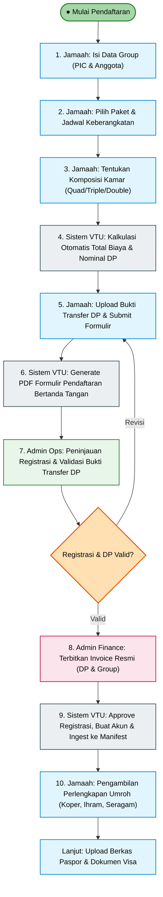
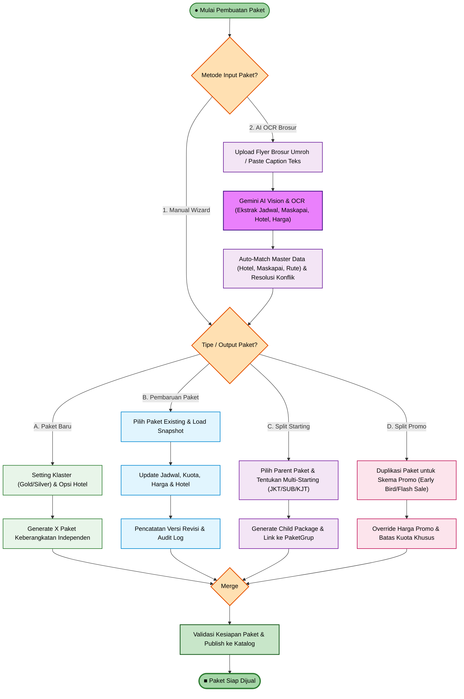

# Dokumentasi BPMN 2.0 — VTU Abadi Operasional System
**Aplikasi Manajemen Operasional Travel Umroh VTU Abadi (`app-admin-vtu`)**  
*Single Source of Truth: Group-Centric Architecture, Package Lifecycle Sub-Process, Corrected 10-Step Registration Flow, Invoicing & Manifest Ingestion*

---

## 1. File Standar BPMN 2.0 XML Resmi Aplikasi

File standar BPMN 2.0 yang dimodelkan langsung dari arsitektur backend, Prisma schema, API routes, dan alur pendaftaran rombongan yang telah dikoreksi telah diperbarui di:
- 👉 [**`docs/bpmn/vtu-operasional-system-bpmn.bpmn`**](file:///d:/Projects/app-admin-vtu/docs/bpmn/vtu-operasional-system-bpmn.bpmn) *(85.3 KB)*

File ini mematuhi standar internasional **OMG BPMN 2.0**, lengkap dengan koordinat visual (BPMNDI), color codes per aktor, **Expanded Sub-Process Container**, gateways, data objects, data stores, serta konektor message flow ke sistem eksternal (Telegram Bot, Gemini AI Vision OCR, Google Drive).

Dapat langsung dibuka & diedit secara visual di:
1. [**demo.bpmn.io**](https://demo.bpmn.io) (Tinggal drag & drop file `.bpmn`)
2. **Camunda Modeler**
3. **Enterprise Architect / Signavio / Visual Paradigm**

---

## 2. Alur Pendaftaran Rombongan & Pengambilan Perlengkapan (Koreksi Alur)

Sesuai kebutuhan operasional nyata di lapangan, urutan registrasi grup jamaah kini tersusun secara berurutan dan transparan:

### Rincian 10 Tahapan:
1. **Isi Data Group (`Task_J_RegisterGroup`)**: Pemohon / PIC mengisi data perwakilan, kontak, dan jumlah serta nama anggota rombongan keluarga.
2. **Pemilihan Paket (`Task_J_PilihPaket`)**: Jamaah memilih program keberangkatan dari katalog yang aktif.
3. **Menentukan Komposisi Kamar (`Task_J_KomposisiKamar`)**: Menentukan alokasi kamar (Quad / Triple / Double) dan pilihan paket hotel.
4. **Hasil Nominal Pembayaran (`Task_Sys_HitungNominal`)**: Sistem di Row 2 secara otomatis mengkalkulasi total biaya dan menampilkan nominal kewajiban Down Payment (DP).
5. **Upload Bukti TF DP & Submit (`Task_J_UploadBuktiDP`)**: Jamaah mentransfer DP sesuai nominal, mengunggah slip setoran/bukti transfer, membubuhkan tanda tangan digital, dan menekan tombol *Submit*.
6. **Generate PDF Formulir (`Task_Sys_GenPDF`)**: Sistem memproduksi berkas PDF Formulir Pendaftaran resmi bertanda tangan, menyimpannya di vault server, dan mengirimkan email konfirmasi.
7. **Peninjauan Admin Operasional (`Task_Ops_ReviewRegistrasi`)**: Tim operasional memeriksa kebenaran data rombongan, ketersediaan kuota seat, dan validitas bukti transfer bank.
8. **Penerbitan Invoice Resmi (`Task_Pay_TerbitkanInvoice`)**: Admin Pembayaran menerbitkan nomor invoice resmi (`INV/YYYY/NNNNN`) tagihan DP dan induk grup.
9. **Ingest ke Manifest (`Task_Sys_IngestManifest`)**: Status registrasi disetujui, akun portal jamaah dibuat, dan seluruh anggota rombongan langsung di-ingest ke dalam **Manifest Keberangkatan**.
10. **Pengambilan Perlengkapan Umroh (`Task_J_AmbilPerlengkapan`)**: Jamaah menerima hak pengambilan paket logistik umroh (koper bagasi, tas paspor, kain ihram / mukena, seragam batik, buku panduan doa).

---

## 3. Rincian Sub-Proses: Pembuatan & Manajemen Paket Umroh

Sub-proses ini ditempatkan di **Row 3 (`ADMIN OPERASIONAL`)** sebagai kontainer *Expanded Sub-Process* (`SubProcess_ManajemenPaket`), mendukung **2 Metode Input** (Manual Wizard vs AI OCR Brosur) dan **4 Skenario Output Manajemen Paket**:

---

## 4. Susunan 8 Swimlanes (Urutan Baris / Row)

| No (Row) | Lane / Role | Kode Role Sistem | Posisi & Tanggung Jawab Utama |
|:---|:---|:---|:---|
| **Row 1** | **JAMAAH / KETUA GROUP** | `jamaah` | Mengisi data group, memilih paket, tentukan kamar, upload bukti bayar DP, terima perlengkapan, upload berkas paspor, pelunasan, hingga keberangkatan dan kepulangan. |
| **Row 2** | **SISTEM VTU & AI ENGINE** | *Automated Service* | Auto-broadcast jadwal ke Telegram, kalkulasi nominal total & DP, generate PDF formulir bertanda tangan, ingest data ke manifest, Gemini OCR, auto-deadlines, sinkronisasi Google Drive, dan immutable `AuditEntry`. |
| **Row 3** | **ADMIN OPERASIONAL** | `admin_operasional` | **Sub-Proses Manajemen Paket:** Paket baru, update, split starting, split promo; peninjauan pendaftaran baru & bukti transfer DP; serta closing paket keberangkatan. |
| **Row 4** | **ADMIN DOKUMEN** | `admin_dokumen` | Manual review berkas buram/OCR error, verifikasi paspor (>6 bulan), approval kelayakan dokumen visa. |
| **Row 5** | **ADMIN PEMBAYARAN** | `admin_pembayaran` | Penerbitan invoice resmi (DP & Pelunasan), invoice split group (A/B/C), rekonsiliasi mutasi bank, alokasi pembayaran per jamaah. |
| **Row 6** | **ADMIN MANIFEST & ROOMING** | `admin_manifest` | Finalisasi manifest jamaah, grouping kombinasi hotel Mekkah/Madinah, dan eksekusi algoritma *Rooming Engine* (Quad/Triple/Double, Mahram & Gender). |
| **Row 7** | **TOUR LEADER** | `tour_leader` | Serah terima (*handover*) final manifest & rooming list, manasik jamaah, pendampingan spiritual & logistik di Makkah/Madinah, laporan TL. |
| **Row 8** | **ADMIN BADAL & WAKAF** | `admin_badal` | Layanan khusus: pemrosesan order badal umroh & wakaf mushaf Quran, penugasan muthawif di Makkah, serta upload video dokumentasi & sertifikat badal. |

---

## 5. Kepatuhan Validasi Standard OMG BPMN 2.0

Verifikasi integritas model XML diuji secara otomatis dengan hasil:
- **Total IDs Terdaftar**: 405 Node & Element
- **Total Warnings**: 0 Warning
- **Status Kompatibilitas**: **100% Valid OMG BPMN 2.0 & BPMNDI Standard** (Bisa langsung dibuka di [demo.bpmn.io](https://demo.bpmn.io) dan Camunda Modeler).
