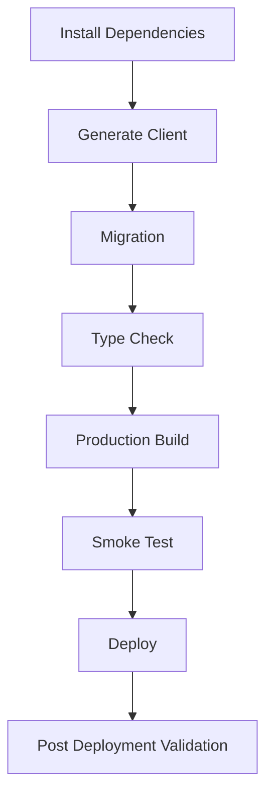

# Build Hygiene Policy

Dokumen ini mendefinisikan kebijakan kebersihan proses build (Build Hygiene) yang wajib dipatuhi dalam pengembangan aplikasi. Kebijakan ini bersifat framework-agnostic dan berlaku untuk Next.js, React, Vite, Node.js, NestJS, Express, maupun future framework lainnya.

## General Principles
*   Dilarang keras menyisakan **Build Artifacts** dari proses build sebelumnya saat melakukan clean build.
*   Seluruh dependensi harus berada dalam state yang konsisten sebelum proses build dimulai.

---

## Standard Build Pipeline (Engineering Workflow)

Berikut adalah urutan wajib (Standard Build Pipeline) perusahaan dalam melakukan kompilasi dan rilis di lingkungan engineering. Proses ini dirancang untuk mendeteksi error se-dini mungkin (Fail Fast).

1.  **Install Dependencies**
    *Tujuan*: Memastikan seluruh dependensi terunduh dan terinstal sesuai dengan definisi dan lockfile (`npm install` / `yarn install`).
2.  **Generate Client**
    *Tujuan*: Membuat kode hasil generate (seperti Prisma Client, GraphQL codegen) agar sinkron dengan skema terbaru (`npx prisma generate`).
3.  **Migration**
    *Tujuan*: Menjalankan DDL ke database agar tabel/kolom berada dalam state yang identik dengan Prisma Client yang baru saja di-generate (`npx prisma migrate deploy`).
4.  **Type Check**
    *Tujuan*: Memvalidasi tipe statis (TypeScript) di seluruh codebase untuk mendeteksi error pada level kompilasi sebelum bundling.
5.  **Production Build**
    *Tujuan*: Menghasilkan Build Artifacts akhir yang dioptimasi (minified, tree-shaken) untuk production (`npm run build`).
6.  **Smoke Test**
    *Tujuan*: Verifikasi kesehatan aplikasi secara lokal (start server & health check).
7.  **Deploy**
    *Tujuan*: Mengunggah artifacts/container ke lingkungan Preview atau Production.
8.  **Post Deployment Validation**
    *Tujuan*: Menjalankan uji integrasi akhir secara nyata di URL target (Validasi UI, Network 200 OK, Log Check).

---

## CI/CD Governance

Dalam otomatisasi menggunakan pipeline Continuous Integration / Continuous Deployment (CI/CD), perusahaan mewajibkan urutan framework agnostic berikut.

### Urutan Minimal Pipeline CI/CD:

1. **Install** (Download package/modules)
2. **Generate** (ORM client, Typedefs)
3. **Migration** (Sinkronisasi DDL Database)
4. **Type Check** (TSC validation)
5. **Build** (Kompilasi source code menjadi binary/static)
6. **Deploy** (Push ke Host/Cloud)
7. **Smoke Test** (Health endpoint `200 OK` check)
8. **Health Check** (Pengecekan load/metric standar)
9. **Release** (Traffic switch / Go-Live)

### Build Gate Philosophy
- **Strict Block**: Jika salah satu langkah di atas gagal (Exit code `> 0`), Pipeline **WAJIB BERHENTI (FAIL)** dan proses Deploy dibatalkan.
- **Fail Fast**: Kegagalan `Type Check` atau `Migration` harus dideteksi sebelum proses `Build` (yang memakan waktu dan resource besar) dimulai.
- **Zero Downtime**: Fase `Deploy` dan `Smoke Test` harus dipisahkan dari `Release`. Jika `Smoke Test` gagal, container baru ditarik mundur (rolled back) tanpa mempengaruhi traffic production.
