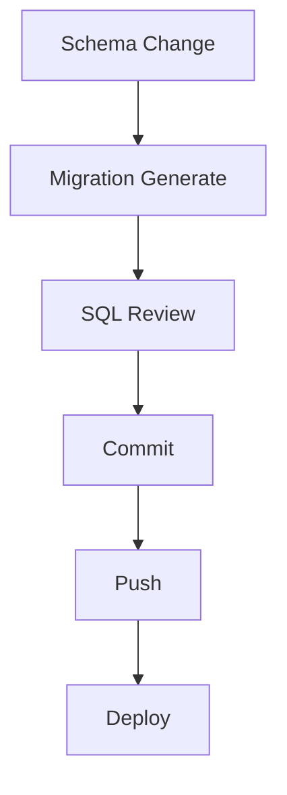

# Database Governance

Dokumen ini merupakan panduan utama (Master Governance) terkait pengelolaan arsitektur database, sinkronisasi skema, dan kebijakan pemulihan basis data di lingkungan produksi perusahaan. Seluruh operasional database **wajib** mematuhi aturan dalam dokumen ini.

---

## 1. Database Architecture
Sistem menggunakan arsitektur Single Source of Truth melalui **Prisma ORM** yang dihubungkan dengan PostgreSQL (via Supabase Pooler). Segala bentuk perubahan DDL (Data Definition Language) wajib direpresentasikan terlebih dahulu dalam file `schema.prisma`.

## 2. Prisma Workflow
Workflow pengembangan menggunakan Prisma terbagi atas 3 fase utama:
1. **Design**: Perubahan dilakukan di `schema.prisma`.
2. **Generation**: `npx prisma generate` memastikan Type-safety (TypeScript) selaras dengan schema.
3. **Execution**: Eksekusi schema ke database menggunakan mekanisme *Push* atau *Migrate* sesuai *Decision Matrix*.

---

## 3. Migration Governance (TASK 1)

Aturan ketat mengenai kapan dan bagaimana migrasi (Migration) dilakukan.

### Kebijakan Utama:
- **Kapan `schema.prisma` boleh diubah?** Hanya ketika ada requirement penambahan fitur baru atau refaktor database yang disetujui Product Owner.
- **Kapan Migration WAJIB dibuat?** Setiap kali ada perubahan di `schema.prisma` yang ditargetkan untuk lingkungan *Staging* atau *Production*.
- **Proses Review SQL**: File `migration.sql` hasil generate **WAJIB** direview oleh peer engineer untuk mendeteksi *destructive operation* secara tidak sengaja.
- **Additive Migration Policy**: Sebisa mungkin, setiap perubahan schema harus bersifat "menambahkan" (Additive). Kolom baru harus bersifat Opsional (`?`) atau memiliki Default Value.
- **Destructive Migration Policy**: Penghapusan kolom (Drop Column), penghapusan tabel, atau pengubahan tipe data (Alter Type) dianggap *Destructive*. **DILARANG KERAS** melakukan destructive migration tanpa proses backup & Architecture Decision Record (ADR) approval.

### Migration Deployment Flow

---

## 4. Schema Governance
Hanya boleh ada 1 file schema utama. Tidak diperkenankan melakukan bypass schema Prisma secara manual (menggunakan SQL Tool eksternal). Semua tabel wajib memiliki Primary Key.

## 5. Relation Governance
Penggunaan relasi Foreign Key (FK) Prisma didorong. Untuk kebutuhan khusus (misal beda database/emulasi), digunakan emulasi relasi di sisi Repository. Cascade Delete tidak direkomendasikan pada transaksi kritikal (misalnya Invoice).

## 6. Index Governance
Setiap kolom yang sering menjadi kriteria pencarian (`where`), filter, atau sort `order by` **WAJIB** ditambahkan `@index`. Tidak diperkenankan membuat *over-indexing* yang membebani insert/update.

---

## 7. Schema Drift Detection (TASK 2)

*Schema Drift* adalah keadaan di mana schema aktual di Database berbeda dengan codebase. Gunakan Checklist berikut untuk validasi:

- [ ] `schema.prisma` sinkron (tidak ada uncommitted changes)
- [ ] Folder `prisma/migrations` sinkron (semua migration SQL eksis di repository)
- [ ] Tabel `_prisma_migrations` sinkron (database telah mencatat history migration)
- [ ] Prisma Client sinkron (kode Typescript mendeteksi struktur tabel terbaru)
- [ ] Database sinkron (DDL kolom fisik di database persis seperti schema.prisma)
- [ ] Production sinkron (Semua check di atas valid pada environment Production)

### Indikator Schema Drift
- **LOW**: Perbedaan default value, constraint ringan.
- **MEDIUM**: Indeks hilang, relasi emulasi hilang.
- **HIGH**: Kolom opsional hilang (Data Insertion akan gagal jika diisi).
- **CRITICAL**: Tabel hilang, kolom *Required* hilang (Runtime Error merusak fitur).

---

## 8. Database Recovery Strategy (TASK 4)

Tabel Keputusan Pemulihan Database:

| Problem | Root Cause | Recovery | Prevention |
|---------|------------|----------|------------|
| **Missing Column** | Lupa deploy migration ke DB / Schema Drift. | Jalankan `prisma migrate deploy` (jika ada migration), atau `prisma db push` (hotfix additive). | Masukkan `prisma migrate deploy` di CI/CD. |
| **Missing Table** | Migration hilang di production. | Jalankan ulang migration. | CI/CD Automation. |
| **Missing Index** | Database admin manual drop index / lupa migration. | Buat migration penambahan index. | Review `migration.sql` ketat. |
| **Wrong Relation** | Typo constraint ForeignKey. | Buat migration Alter Table. | Test lokal secara menyeluruh. |
| **Schema Drift** | Dev push langsung (db push) ke DB tanpa commit migration. | Baseline ulang database (pull / buat baseline migration). | Patuhi Decision Matrix. |
| **Migration Missing** | File `migration.sql` tidak ter-commit. | *Hotfix Additive* (lihat EEOS v1.2) - buat ulang migration SQL dari schema. | Pre-commit hook & Git Status audit. |
| **Prisma Client Outdated** | Lupa `prisma generate` setelah ubah schema. | Jalankan `npx prisma generate`. | Wajibkan `prisma generate` di build script. |
| **Database Connection Failed**| Credentials salah atau IP terblokir firewall. | Verifikasi `.env`, check firewall whitelist Supabase. | Host variable management. |
| **Environment Missing** | File `.env` tidak termuat pada Standalone Build. | `node --env-file=.env` (untuk testing lokal). | Dokumentasi deployment host. |
| **Deployment Missing Migration** | Script CI/CD tidak mengandung perintah migrate. | Tambahkan urutan migration di CI/CD. | Standarisasi Build Pipeline. |

---

## 9. Production Rules
Semua eksekusi Prisma di production bersifat *One-Way*. Tidak boleh ada eksekusi *Reset* (seperti `prisma migrate reset`).

## 10. Hotfix Policy
Lihat `EEOS v1.2`. Hotfix hanya diperbolehkan jika *Confidence Level* dinyatakan CONFIRMED dan didukung oleh *Evidence* (contoh: Build Log, Runtime Log). Perubahan Hotfix Database harus bersifat **Additive**.

## 11. Rollback Policy
Jika migration terlanjur jalan dan corrupt, segera pulihkan dari Automated Daily Backup Supabase. Dilarang me-rollback migration secara manual dengan men-drop column (karena berisiko menghapus data production eksisting).

## 12. Database Review Checklist
Sebelum memberikan persetujuan pada Merge Request terkait Schema:
- [ ] Apakah tabel baru relevan?
- [ ] Apakah migration bersifat destructive?
- [ ] Apakah tipe data sesuai dan aman?

---

## 13. Decision Matrix Deployment Database (TASK 5)

Panduan mengenai kapabilitas Prisma CLI mana yang boleh dan dilarang pada masing-masing environment.

| Environment | `db push` | `migrate dev` | `migrate deploy` | Penjelasan |
|-------------|-----------|---------------|------------------|-------------|
| **Local** | ✅ Diperbolehkan | ✅ Diperbolehkan | ✅ Diperbolehkan | Aman. Digunakan untuk rapid prototyping (`db push`) dan menghasilkan file migration (`migrate dev`). |
| **Preview** | ✅ Darurat (Hotfix) | ❌ Dilarang | ✅ Wajib | Idealnya memakai `migrate deploy`. `db push` hanya boleh dipakai saat recovery *Schema Drift* di mana tabel `_prisma_migrations` hilang. |
| **Staging** | ❌ Dilarang | ❌ Dilarang | ✅ Wajib | Pipeline standar CI/CD, hanya eksekusi file migration yang fix. |
| **Production** | ❌ Dilarang | ❌ Dilarang | ✅ Wajib | DILARANG KERAS menggunakan `db push` atau `migrate dev`. Segala mutasi Production murni melalui riwayat `migration.sql`. |
