# Engineering Document Relationship

Dokumen **`README.md`** dan **`engineering_playbook.md`** merupakan titik pusat ekosistem (Master Engineering Governance) yang memandu dan mengorganisir seluruh standar teknis dan SOP Engineering perusahaan.

## Hubungan Dokumentasi (v2.2 Final)

Struktur pengelompokan dokumentasi secara logis adalah sebagai berikut:

```mermaid
graph TD
    %% Master / Entry Point
    Root[README.md<br/>Enterprise Handbook] --> Playbook[engineering_playbook.md<br/>Master Governance]
    
    %% Categories
    Playbook --> Core[Core Governance]
    Playbook --> Comp[Company Standards]
    Playbook --> Std[Engineering Standards]
    Playbook --> DB[Database]
    Playbook --> Sec[Security]
    Playbook --> Ops[Operations]
    Playbook --> Deploy[Deployment]

    %% Core Governance
    Core --> Life[governance_lifecycle.md]
    Core --> Hist[governance_version_history.md]
    Core --> Glos[governance_glossary.md]

    %% Company Standards
    Comp --> CStd[company_engineering_standard.md]
    Comp --> ADR[architecture_decision_record.md]

    %% Engineering Standards
    Std --> Code[coding_standards.md]
    Std --> Test[testing_governance.md]
    Std --> Perf[performance_governance.md]

    %% Database
    DB --> DBGov[database_governance.md]

    %% Security
    Sec --> SecGov[security_governance.md]

    %% Operations
    Ops --> Obs[observability_governance.md]
    Ops --> Inc[incident_recovery_flow.md]
    Ops --> Rec[engineering_recommendation.md]

    %% Deployment
    Deploy --> Rel[release_governance.md]
    Deploy --> Build[build_hygiene_policy.md]
    Deploy --> DEnv[deployment_environment_guide.md]
    Deploy --> DChk[deployment_checklist.md]
    Deploy --> DTrb[deployment_troubleshooting.md]
```

### Penjelasan Kelompok:
- **Core Governance**: Penjelasan siklus hidup dokumen, kamus istilah (*Glossary*), dan sejarah versi dokumen, memandu agar standarisasi tetap terkontrol.
- **Company Standards**: Aturan dasar minimal yang mutlak bagi proyek, serta mekanisme rekam jejak keputusan sistematis (ADR).
- **Engineering Standards**: Peraturan teknis seputar gaya penulisan kode, pemastian kualitas (*testing coverage*), serta anggaran performa aplikasi.
- **Database**: Regulasi krusial mengenai sinkronisasi *Schema*, *Migration*, hingga mitigasi bahaya *Schema Drift*.
- **Security**: Aspek keamanan aplikasi, rotasi kredensial, proteksi environment, dan *Least Privilege Principle*.
- **Operations**: Tata cara pemantauan aplikasi di production (*observability*), penyelesaian *incident*, serta hirarki analisis kerusakan.
- **Deployment**: Standarisasi fase kompilasi (*Build Hygiene*), pelepasan fitur (*Release*), panduan *environment*, serta mitigasi jika gagal *deploy*.
