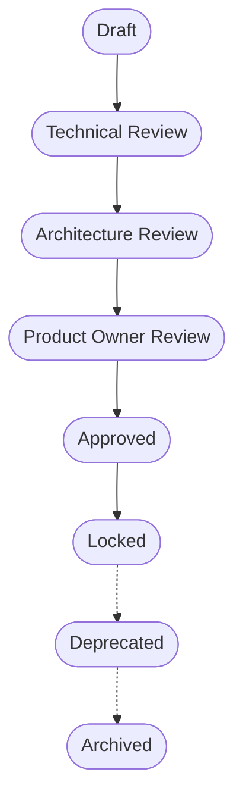

# Document Lifecycle Governance

Siklus Hidup (Lifecycle) dari setiap dokumentasi formal perusahaan direpresentasikan oleh status dokumen tersebut. Hal ini memastikan bahwa dokumen hanya dijadikan pedoman (SSOT) jika sudah tervalidasi dan diotorisasi.

## Lifecycle Status Flow

## Tujuan Setiap Status

### 1. Draft
Fase awal pembuatan (atau revisi) dokumentasi oleh *Document Owner* atau *Engineer*. Dokumen dengan status *Draft* belum berlaku dan tidak mengikat siapapun. Tujuannya adalah menginisiasi kerangka dasar kebijakan baru.

### 2. Technical Review
Draft dokumen di-review (*peer review*) oleh engineer lain. Tujuannya untuk memastikan validitas informasi operasional, pengecekan konsistensi dengan kebijakan yang ada, serta perbaikan *typo* atau *formatting*.

### 3. Architecture Review
Review difokuskan pada implikasi kebijakan terhadap keandalan infrastruktur dan kesiapan skalabilitas (Skala, Performa, dan *Security*). Tujuannya untuk menilai apakah prosedur yang baru akan mengubah postur atau topologi *Architecture Governance*.

### 4. Product Owner Review
Tinjauan akhir oleh *Product Owner* yang memvalidasi bahwa standarisasi teknis (maupun konsekuensinya seperti pembesaran SLA atau downtime maintenance) sejalan dengan prioritas, nilai bisnis, dan kesiapan operasional tim perusahaan.

### 5. Approved
Dokumen disetujui. Standar atau prosedur yang tertuang dalam dokumen ini **Mulai Berlaku** (Effective). Seluruh tim wajib mulai mengadopsi standar tersebut secara aktif.

### 6. Locked
Status stabil jangka panjang. Versi dokumen telah final dan diadopsi dalam skala perusahaan (*Company-Wide Adoption*). Pada tahap ini, tidak boleh ada penambahan kebijakan yang mengubah konteks. Pemutakhiran mayor hanya boleh diawali dari fase *Draft* versi baru.

### 7. Deprecated
Dokumen tersebut sudah usang atau akan segera digantikan oleh standar yang lebih baru. Tim *engineering* tidak direkomendasikan merujuk kepada dokumen ini, tetapi arsipnya belum dicabut sepenuhnya (biasanya memberikan *grace period* bagi *legacy code*).

### 8. Archived
Dokumen ditarik dari status aktif dan dianggap telah sepenuhnya tidak berlaku (*Obsolete*). Tujuannya hanya sebagai referensi historis pengambilan keputusan di masa lalu.
