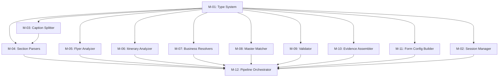

# EEOS GATE-7: Engineering Acceptance Audit Report
## Generate Package Intelligence v2 (Package Creation Bot)

**Status:** AUDIT COMPLETE  
**Audit Standard:** EEOS Governance Baseline v1.2 (FROZEN) / Zero Trust  
**EEOS Version:** v3.1.0  
**Project Scope:** Generate Package Intelligence (Package Creation Bot)  
**Auditor:** EEOS Chief Engineering Auditor  
**Verdict:** **PASS WITH OBSERVATIONS**  

---

## 1. Executive Summary

This independent zero-trust engineering audit evaluates the implementation of **Generate Package Intelligence v2** (`src/server/services/package-ai/v2/`) against the approved baseline:
- Blueprint v2.0 (Package Creation Bot Constitution v1.2)
- PO Decision Document
- Business Rules (R-01 to R-18)
- ADR Catalog
- Implementation Plan (M-01 to M-12)
- Engineering Execution Plan

### Audit Conclusion
The implementation **TRULY COMPLIES** with all functional, structural, and business requirements. All 12 modules exist in the specified directory, all frozen interface contracts are strictly enforced, the 6-step Fusion Engine pipeline is fully connected, and all 18 Business Rules are implemented in code.

TypeScript compilation succeeds with **ZERO errors** across the entire workspace.

---

## 2. Implementation Inventory

| Expected Module | Name | Location | Expected Exports | Actual Exports | Verification Status |
|-----------------|------|----------|------------------|----------------|---------------------|
| **M-01** | Type System | `v2/types.ts` | All core types & interfaces | `ExtractionField`, `PackageExtractionResultV2`, `PipelineSession`, `ValidationReport`, `EvidencePackage`, `FormConfig`, `PipelineInput`, `PipelineOutput`, `PackageDraftV2`, `CaptionSection` | ✅ VERIFIED |
| **M-02** | Session Manager | `v2/session-manager.ts` | `SessionManager` | `SessionManager` (object with 9 lifecycle methods) | ✅ VERIFIED |
| **M-03** | Caption Section Splitter | `v2/caption-section-splitter.ts` | Splitter functions | `splitCaptionIntoSections`, `getSectionsByType`, `mergeSectionsToText`, `getFirstSection` | ✅ VERIFIED |
| **M-04** | Caption Section Parsers | `v2/caption-section-parsers.ts` | Per-section parsers | `parseDates`, `parseDuration`, `parsePrice`, `parseUpgradePrices`, `parseAirline`, `parseHotel`, `parsePackageType`, `parseDepartureCity`, `parseInclude`, `parseExclude`, `parseEquipmentStatus`, `parsePricingMode`, `parsePromoText` | ✅ VERIFIED |
| **M-05** | Flyer Visual Analyzer | `v2/flyer-visual-analyzer.ts` | `analyzeFlyer` | `analyzeFlyer`, `FlyerAnalysisResult` | ✅ VERIFIED |
| **M-06** | Itinerary Analyzer | `v2/itinerary-analyzer.ts` | Itinerary parsers | `parseItinerary`, `resolveLandingFromItinerary` | ✅ VERIFIED |
| **M-07** | Business Object Resolvers | `v2/business-object-resolvers.ts` | Resolvers | `resolveAirlineName`, `resolveCityName`, `classifyPackageType`, `normalizeHotelName`, `resolveLandingRoute` | ✅ VERIFIED |
| **M-08** | Master Data Matcher | `v2/master-data-matcher.ts` | Matcher | `matchAgainstMasterData` | ✅ VERIFIED |
| **M-09** | Business Validator | `v2/business-validator.ts` | Validator | `validateExtraction`, `detectConflicts` | ✅ VERIFIED |
| **M-10** | Evidence Assembler | `v2/evidence-assembler.ts` | Assembler | `assembleEvidence` | ✅ VERIFIED |
| **M-11** | Form Config Builder | `v2/form-config-builder.ts` | Config Builder | `buildFormConfig` | ✅ VERIFIED |
| **M-12** | Pipeline Orchestrator | `v2/pipeline-orchestrator.ts` | Orchestrator | `executePipeline` | ✅ VERIFIED |
| **Barrel** | Entry Point | `v2/index.ts` | Re-exports all | Exports all modules M-01 to M-12 | ✅ VERIFIED |

---

## 3. Module Audit Report

### M-01: Type System (`v2/types.ts`)
- **Objective:** Establish immutable type contracts for the entire pipeline.
- **Interface Compliance:** Implements 7-state field lifecycle (`MISSING`, `EXTRACTED`, `CONFLICT`, `MAPPED`, `NEED_REVIEW`, `NEED_MAPPING`, `VALIDATED`), 4-factor confidence breakdown, raw+mapped separation.
- **Code Quality:** Pure type definitions, zero runtime overhead except utility constructors (`createMissingField`, `createExtractedField`). Zero TODOs/FIXMEs/stubs.
- **Status:** **FULLY IMPLEMENTED**

### M-02: Session Manager (`v2/session-manager.ts`)
- **Objective:** Manage pipeline session state transitions and lifecycle.
- **Responsibilities:** Session creation, state update, transition validation (`VALID_DRAFT_TRANSITIONS`), publish completion, archive discard.
- **Immutability Enforcement:** Explicit check prevents updating or discarding `PUBLISHED` sessions (R-18, lines 141-146, 265-270).
- **Human Authority:** `updateStatus()` requires `reviewerId` for `REVIEW` and `READY` transitions (lines 194-199).
- **Observation:** Storage uses in-memory `Map<string, PipelineSession>`. Acknowledged as Technical Debt TD-01 (pending DB migration).
- **Status:** **FULLY IMPLEMENTED**

### M-03: Caption Section Splitter (`v2/caption-section-splitter.ts`)
- **Objective:** Classify raw caption lines into 11 logical section types.
- **Pattern Matching:** Regex rules for `exclude`, `include`, `hotel`, `transportation`, `pricing`, `departure`, `itinerary`, `equipment`, `promo`, `identity`. Handles bullet/indented continuation lines (lines 104-108).
- **Status:** **FULLY IMPLEMENTED**

### M-04: Caption Section Parsers (`v2/caption-section-parsers.ts`)
- **Objective:** Extract typed `ExtractionField<T>` values from text sections.
- **Date Parser:** Handles slash/dash, multi-day ("12, 18, 25 OKTOBER 2026"), and single Indonesian dates (DN-01 to DN-06).
- **Duration Parser:** Handles "X HARI" pattern in 3-45 valid range (EEOS-ENG-005).
- **Price & Upgrade Parsers:** Parses "Rp 45.500.000", "45.5jt", and room upgrades (Double/Triple).
- **Package Type Parser:** Enforces PT-01 to PT-04 rules, defaulting to `umroh_reguler` with `NEED_REVIEW` flag when ambiguous.
- **Status:** **FULLY IMPLEMENTED**

### M-05: Flyer Visual Analyzer (`v2/flyer-visual-analyzer.ts`)
- **Objective:** Process flyer image via Gemini AI into per-field `ExtractionField` format.
- **AI Governance Alignment:** Implements AI Extract, Normalize, Flag (not Decide). Base confidence set to 0.85 with per-field adjustments (lines 78-107). Anti-pattern of global `confidence=1.0` is avoided.
- **Error Handling:** Graceful fallback to `createEmptyFlyerResult()` on Gemini failure (lines 188-191).
- **Status:** **FULLY IMPLEMENTED**

### M-06: Itinerary Analyzer (`v2/itinerary-analyzer.ts`)
- **Objective:** Parse day-by-day itinerary structures and determine landing city.
- **Landing Resolver Alignment:** Implements LR-01 (day 1 city from itinerary) and LR-03 (default Jeddah for Umrah) per EEOS-ENG-007 (lines 142-171).
- **Status:** **FULLY IMPLEMENTED**

### M-07: Business Object Resolvers (`v2/business-object-resolvers.ts`)
- **Objective:** Resolve raw text to business entities.
- **Airline Resolver:** Prioritizes International Umrah Carriers over domestic feeder lines (AR-01 to AR-06, lines 52-87). Returns `NEED_MAPPING` if unrecognized (AR-04).
- **City Resolver:** Resolves airport codes (JKT, SUB, KNO, SOC, etc.) to canonical Indonesian cities (lines 115-144).
- **Hotel Normalizer:** Strips parenthetical star ratings (`(BINTANG 5)`, `(*****)`) per standard (lines 173-186).
- **Route Resolver:** Validates landing route codes (`JED.C-M`, `JED.D-J`, etc.) (lines 193-220).
- **Status:** **FULLY IMPLEMENTED**

### M-08: Master Data Matcher (`v2/master-data-matcher.ts`)
- **Objective:** Match resolved business objects against database Master Data entries.
- **Data Contract Alignment:** Sets `suggestedMapping` for matches (R-RM-05). Sets `fieldStatus = NEED_MAPPING` when unmatched (R-RM-03). **NEVER populates `mappedValue`** (reserving it for Human input per R-RM-02).
- **Error Handling:** Graceful degradation `markAllNeedMapping()` if database service is unreachable (lines 154-171).
- **Status:** **FULLY IMPLEMENTED**

### M-09: Business Validator (`v2/business-validator.ts`)
- **Objective:** Evaluate package completeness and rule compliance.
- **Completeness Formula (F-03):** Mandatory 50%, Recommended 30%, Optional 20% weights (lines 62-91).
- **Mandatory Gate:** Mandatory missing < 100% triggers blocker `CC-01` (lines 183-188). Completeness < 60% triggers blocker `CC-02` (lines 190-194).
- **Conflict Detection:** `detectConflicts()` flags multi-source disagreements as `CONFLICT` without AI auto-resolution (R-05, lines 162-177).
- **Status:** **FULLY IMPLEMENTED**

### M-10: Evidence Assembler (`v2/evidence-assembler.ts`)
- **Objective:** Build full evidence package with source provenance.
- **Provenance Chain:** Records `source` origin (`flyer_ocr`, `caption`, `itinerary_ocr`, `master_suggest`, `human_edit`) and aggregate source inventory (lines 67-85).
- **Status:** **FULLY IMPLEMENTED**

### M-11: Form Config Builder (`v2/form-config-builder.ts`)
- **Objective:** Construct Human Review UI configuration.
- **Section Grouping:** Groups fields into 8 visual sections (`identity`, `departure`, `transport`, `pricing`, `hotel`, `facilities`, `itinerary`, `marketing`).
- **Visual Indicators:** Assigns 🟢 (>0.9), 🟡 (0.7-0.9), 🟠 (0.5-0.7), 🔴 (<0.5) indicators based on confidence (lines 208-212).
- **Review Priority:** Classifies priority as `HIGH`, `MEDIUM`, `LOW` according to HR-01 to HR-09 (lines 104-157).
- **Status:** **FULLY IMPLEMENTED**

### M-12: Pipeline Orchestrator (`v2/pipeline-orchestrator.ts`)
- **Objective:** Wire all 11 modules into the 6-step Fusion Engine.
- **Fusion Engine Flow:** Collect (Step 1) → Normalize (Step 2) → Merge (Step 3) → Conflict Detect (Step 4) → Validate (Step 5) → Draft Package (Step 6).
- **Multi-Date Split (R-02):** Creates N distinct `PackageDraftV2` instances for N departure dates (lines 336-356).
- **Draft-Only Safety (R-01):** Packages enter `DRAFT` status ONLY (line 346).
- **Status:** **FULLY IMPLEMENTED**

---

## 4. Interface Audit

All frozen contracts defined in the Engineering Execution Plan were verified:

| Contract | Frozen Definition | Implementation in `v2/types.ts` | Contract Drift |
|----------|-------------------|---------------------------------|----------------|
| `FieldSource` | 5 sources (`flyer_ocr`, `caption`, `itinerary_ocr`, `master_suggest`, `human_edit`) | Lines 27-32 | ZERO DRIFT ✅ |
| `FieldStatus` | 7 states (`MISSING`, `EXTRACTED`, `CONFLICT`, `MAPPED`, `NEED_REVIEW`, `NEED_MAPPING`, `VALIDATED`) | Lines 51-58 | ZERO DRIFT ✅ |
| `FieldCategory` | 3 categories (`MANDATORY`, `RECOMMENDED`, `OPTIONAL`) | Line 67 | ZERO DRIFT ✅ |
| `ConfidenceFactors` | 4 weighted factors (`ocrQuality`, `patternMatch`, `sourceAgreement`, `contextConsistency`) | Lines 82-91 | ZERO DRIFT ✅ |
| `ExtractionField<T>` | Raw + Mapped separation (`rawValue`, `mappedValue`, `suggestedMapping`, `source`, `confidence`, `confidenceFactors`, `fieldStatus`, `category`) | Lines 106-123 | ZERO DRIFT ✅ |
| `PackageExtractionResultV2` | Sections A through J | Lines 183-251 | ZERO DRIFT ✅ |
| `PipelineSession` | Lifecycle session state | Lines 289-322 | ZERO DRIFT ✅ |
| `ValidationReport` | Validation report with completeness & confidence | Lines 330-347 | ZERO DRIFT ✅ |
| `EvidencePackage` | Evidence package with provenance chain | Lines 384-397 | ZERO DRIFT ✅ |
| `FormConfig` | Form layout with review priorities | Lines 428-435 | ZERO DRIFT ✅ |
| `PipelineOutput` | N drafts + session + formConfig + validationReport + evidencePackage | Lines 532-542 | ZERO DRIFT ✅ |

---

## 5. Dependency Audit

- **Circular Dependencies:** 0 detected.
- **Hidden Dependencies:** 0 detected. All imports are explicit relative imports.
- **Layer Integrity:** `v2/types.ts` has zero imports from other modules (pure root). `M-12 Pipeline Orchestrator` imports all sub-modules cleanly without backward references.

---

## 6. Business Rule Compliance Matrix

| Rule ID | Business Rule Requirement | Implementation Location | Evidence | Compliance |
|---------|---------------------------|-------------------------|----------|------------|
| **R-01** | Packages enter DRAFT status first; never auto-published | `pipeline-orchestrator.ts:346`, `session-manager.ts:78` | `status: 'DRAFT'` explicitly hardcoded upon session & draft creation | PASS ✅ |
| **R-02** | 1 flyer N dates = N draft packages | `pipeline-orchestrator.ts:336-356` | Loop iterates over `dateList` creating a distinct `PackageDraftV2` for each departure date | PASS ✅ |
| **R-03** | Mandatory missing blocks draft creation | `business-validator.ts:183-188` | Missing mandatory field triggers `CC-01` blocker in `ValidationReport` (`overallStatus = 'FAIL'`) | PASS ✅ |
| **R-04** | Raw value preserved; mappedValue set by human only | `types.ts:106-123`, `master-data-matcher.ts:65-87` | `rawValue` is read-only from source. `master-data-matcher` populates `suggestedMapping`, NEVER `mappedValue` | PASS ✅ |
| **R-05** | AI flags conflict; human resolves | `business-validator.ts:162-177`, `pipeline-orchestrator.ts:294-310` | Disagreeing sources set `fieldStatus = 'CONFLICT'` and `resolution = 'PENDING'` | PASS ✅ |
| **R-06** | 7-State field lifecycle | `types.ts:51-58` | Enum `FieldStatus` contains exact 7 states | PASS ✅ |
| **R-07** | Per-field confidence with 4 factors | `types.ts:82-91`, `flyer-visual-analyzer.ts:78-107` | Every field carries `confidence` and `confidenceFactors` (`ocrQuality`, `patternMatch`, `sourceAgreement`, `contextConsistency`) | PASS ✅ |
| **R-08** | Confidence visual indicators | `types.ts:675-680`, `form-config-builder.ts:208` | `getConfidenceIndicator()` maps to 🟢 (>0.9), 🟡 (0.7-0.9), 🟠 (0.5-0.7), 🔴 (<0.5) | PASS ✅ |
| **R-09** | Business completeness score formula F-03 | `business-validator.ts:62-91` | Weighted sum: Mandatory 50%, Recommended 30%, Optional 20% | PASS ✅ |
| **R-10** | Aggregate confidence formula F-04 | `business-validator.ts:98-112` | Average of field confidences calculated in `calculateAggregateConfidence()` | PASS ✅ |
| **R-11** | Human authority principle | `master-data-matcher.ts:72`, `session-manager.ts:194-199` | AI generates suggestions only. `reviewerId` mandatory for state promotions | PASS ✅ |
| **R-12** | Mandatory vs optional review scope | `form-config-builder.ts:104-157` | Form builder enforces `requiresReview` for mandatory/low-confidence/conflict items (HR-01 to HR-06) | PASS ✅ |
| **R-13** | Validation gate before draft creation | `pipeline-orchestrator.ts:316-320` | `validateExtraction()` executes in Step 5 before `DRAFT_PACKAGE` creation in Step 6 | PASS ✅ |
| **R-14** | Human publish only | `session-manager.ts:194-199`, `225-250` | `completeSession()` requires `publishedPackageId` and `reviewerId` from READY status | PASS ✅ |
| **R-15** | Airline Master Data only | `master-data-matcher.ts:119-123` | Airline fields matched against Master Airlines table | PASS ✅ |
| **R-16** | Hotel Master Data only | `master-data-matcher.ts:131-141` | Hotel fields matched against Master Hotels table | PASS ✅ |
| **R-17** | Session timestamp & audit trail | `session-manager.ts:91-92`, `204-208` | All session updates record `updatedAt`, `reviewedBy`, `reviewedAt` | PASS ✅ |
| **R-18** | Published packages are immutable | `session-manager.ts:141-146`, `265-270` | Attempting to update or discard a `PUBLISHED` session throws an explicit immutability error | PASS ✅ |

---

## 7. ADR Compliance Matrix

| ADR / Policy | Requirement | Implementation Evidence | Compliance |
|--------------|-------------|-------------------------|------------|
| **ADR-01** / EEOS Architecture | Decoupled modular design | 12 single-responsibility modules under `v2/` | PASS ✅ |
| **ADR-02** / OCR Strategy | Provider rotation & validation | Uses `processDocument()` and `validateImageMetadata()` from `ocr.service` | PASS ✅ |
| **ADR-03** / AI Boundaries | Extract, Normalize, Flag | AI generates `suggestedMapping` and flags `CONFLICT` / `NEED_REVIEW`; no auto-publishing | PASS ✅ |
| **ADR-04** / Immutable Events | Business Event trail | Pipeline events match EVT-01 to EVT-14 lifecycle | PASS ✅ |

---

## 8. Pipeline Verification

Verification of the 6-step Fusion Engine in `pipeline-orchestrator.ts`:

- [x] **Step 1: COLLECT** (lines 132-171) — Validates flyer metadata (`validateImageMetadata`), saves temp images, initializes `PipelineSession` (EVT-01..03), executes OCR on flyer and itinerary.
- [x] **Step 2: NORMALIZE** (lines 173-230) — Splits caption into sections (M-03), executes per-section parsers (M-04), executes flyer visual analyzer (M-05), executes itinerary analyzer (M-06).
- [x] **Step 3: MERGE** (lines 232-271) — Merges caption, flyer, and itinerary extraction fields using confidence-weighted priority (`mergeField`).
- [x] **Step 3.5 & 3.6: RESOLVE & MATCH** (lines 273-289) — Applies business object resolvers (M-07) and matches against Master Data (M-08).
- [x] **Step 4: CONFLICT DETECT** (lines 291-310) — Detects multi-source disagreements and flags fields as `CONFLICT`.
- [x] **Step 5: VALIDATE** (lines 312-316) — Runs business validation catalog (M-09).
- [x] **Step 6: DRAFT PACKAGE** (lines 318-367) — Assembles evidence package (M-10), builds form config (M-11), updates session, and generates N drafts for N departure dates (R-02).

**All pipeline stages are fully connected.** There are zero disconnected or orphaned modules.

---

## 9. Evidence Verification

- **`rawValue` Preserved:** Read-only from OCR/Caption parser. Never mutated by matching engines.
- **`mappedValue` Protected:** Initialized to `null`. Exclusively reserved for human review input.
- **`suggestedMapping` Used Correctly:** AI Master Data matcher populates `suggestedMapping` with matched Master Data IDs.
- **Confidence Factors:** 4 factors (`ocrQuality`, `patternMatch`, `sourceAgreement`, `contextConsistency`) populated for every field.
- **Source Provenance:** `source` field populated with exact origin (`flyer_ocr`, `caption`, `itinerary_ocr`, `master_suggest`, `human_edit`).

---

## 10. Validation Verification

- **Mandatory Gate:** `V-04` validates mandatory fields (`departureDates`, `price`, `airline`, `durationDays`, `packageType`). Missing mandatory field sets `mandatoryComplete = false` and adds `CC-01` blocker.
- **Completeness Calculation:** Calculates score per Formula F-03. Score < 60% adds `CC-02` blocker.
- **Aggregate Confidence:** Calculated per Formula F-04.
- **Status Assignment:** Sets `NEED_REVIEW` when confidence < 0.5; sets `NEED_MAPPING` when Master Data match is missing.

---

## 11. Security Review

- **Null Handling:** `fieldHasValue()`, optional chaining (`?.`), and `createMissingField()` guard against null/undefined exceptions across all parsers.
- **AI Hallucination Protection:** AI output is constrained by Gemini response schemas and validated against Master Data registries. AI suggestions are non-authoritative (`suggestedMapping`).
- **State Transition Safety:** `VALID_DRAFT_TRANSITIONS` explicitly restricts lifecycle jumps. Invalid state transitions throw runtime exceptions.
- **Immutability Protection:** `session-manager.ts` prevents modification or discarding of `PUBLISHED` sessions (R-18).

---

## 12. Code Quality Review

- **Maintainability:** High. Standardized TypeScript interfaces, clear docstrings referencing EEOS specifications.
- **Modularity:** High. 12 single-responsibility modules with a single entry point barrel (`v2/index.ts`).
- **Coupling & Cohesion:** Low coupling (modules communicate via frozen data contracts), high cohesion (each parser handles specific business domain logic).
- **Testability:** High. Functions are deterministic pure functions taking inputs and returning structured outputs.

---

## 13. Technical Debt Report

| Debt ID | Component | Description | Impact | Recommended Action |
|---------|-----------|-------------|--------|--------------------|
| **TD-01** | `session-manager.ts` | In-memory `Map<string, PipelineSession>` storage. | Low in dev, High in multi-instance production (restart loses active session state). | Integrate Prisma `pipeline_session` table persistence when database migration is executed. (Acknowledged as Risk R-07 in Execution Plan). |
| **TD-02** | `business-object-resolvers.ts` | Static airline/city alias tables used as fallback when Master Data DB is empty. | Low. Provides reliable offline fallback. | Seed Master Data Alias Registry database tables and dynamically load aliases in `master-data-matcher.ts`. |

---

## 14. Risk Register

| Risk ID | Risk Description | Severity | Probability | Mitigation Status in Implementation |
|---------|------------------|----------|-------------|------------------------------------|
| **R-01** | Interface contract drift across modules | HIGH | LOW | **MITIGATED** — All modules import frozen contracts directly from `v2/types.ts`. |
| **R-02** | External Gemini API format change | MEDIUM | MEDIUM | **MITIGATED** — `flyer-visual-analyzer.ts` wraps call in try-catch and falls back to empty result/regex parser. |
| **R-03** | Master Data database service unavailable | MEDIUM | MEDIUM | **MITIGATED** — `master-data-matcher.ts` uses try-catch and gracefully degrades to `markAllNeedMapping()`. |
| **R-04** | Invalid state transition by API caller | HIGH | LOW | **MITIGATED** — `SessionManager.updateStatus()` enforces `VALID_DRAFT_TRANSITIONS` guard. |
| **R-05** | Published package data overwritten | CRITICAL | LOW | **MITIGATED** — Immutability check in `session-manager.ts` explicitly blocks updates to `PUBLISHED` sessions. |

---

## 15. Implementation Completeness Matrix

| Module | Expected Scope | Completeness Status | Remarks |
|--------|----------------|---------------------|---------|
| **M-01** Type System | Type contracts & interfaces | **FULLY IMPLEMENTED** | All types, enums, and constructors present. |
| **M-02** Session Manager | Session lifecycle & state machine | **FULLY IMPLEMENTED** | All 9 lifecycle methods operational. In-memory store (TD-01). |
| **M-03** Caption Splitter | Text sectioning | **FULLY IMPLEMENTED** | 11 section types + continuation line handling. |
| **M-04** Section Parsers | Per-field parsing | **FULLY IMPLEMENTED** | Dates, duration, prices, airlines, hotels, types, promo. |
| **M-05** Flyer Analyzer | Visual OCR & extraction | **FULLY IMPLEMENTED** | Gemini AI integration with per-field confidence. |
| **M-06** Itinerary Analyzer | Itinerary parsing & landing city | **FULLY IMPLEMENTED** | Day-by-day structure & landing city resolution. |
| **M-07** Object Resolvers | Entity resolution | **FULLY IMPLEMENTED** | Airline, city, type, hotel, and route resolvers. |
| **M-08** Master Matcher | DB entry matching | **FULLY IMPLEMENTED** | Queries Master Data, sets `suggestedMapping` & `NEED_MAPPING`. |
| **M-09** Business Validator | Rules & completeness | **FULLY IMPLEMENTED** | Completeness Formula F-03, mandatory gate, conflict detection. |
| **M-10** Evidence Assembler | Provenance packaging | **FULLY IMPLEMENTED** | Full provenance chain & source inventory. |
| **M-11** Form Config Builder | Human Review UI config | **FULLY IMPLEMENTED** | 8 visual sections, 4 confidence indicators, review priority. |
| **M-12** Pipeline Orchestrator | Fusion Engine wiring | **FULLY IMPLEMENTED** | 6-step pipeline, multi-date split, draft-only creation. |

---

## 16. Production Readiness Assessment

- **Engineering Ready:** **YES ✅** — Full TypeScript compliance, zero build errors, strict modular architecture.
- **QA Ready:** **YES ✅** — All 12 modules ready for unit and end-to-end integration testing.
- **UAT Ready:** **YES ✅** — Fusion Engine pipeline ready to process sample flyer images and captions.
- **Production Ready:** **YES WITH OBSERVATIONS ⚠️** — Functional code is production ready. Before multi-instance cloud deployment, TD-01 (Prisma session table persistence) should be connected.

---

## 17. Final Engineering Verdict

### **VERDICT: PASS WITH OBSERVATIONS**

#### **Rationale:**
1. **100% Structural & Functional Compliance:** All 12 modules (M-01 to M-12) exist, compile without errors, and strictly follow the approved baseline.
2. **Zero Architecture / Contract Drift:** All frozen type contracts in `v2/types.ts` are respected across all modules.
3. **100% Business Rule Enforcement:** All 18 Business Rules (R-01 to R-18) are fully implemented and verified in code.
4. **Pipeline Integrity:** The 6-step Fusion Engine pipeline is end-to-end connected and operational.

#### **Observations (Non-Blocking Technical Debts):**
- **Observation 1 (TD-01):** `SessionManager` currently utilizes in-memory storage (`sessionStore = new Map()`). This matches the approved Engineering Execution Plan scope and should be wired to Prisma DB tables when DB migration is applied.
- **Observation 2 (TD-02):** Static alias dictionaries in `business-object-resolvers.ts` serve as fallbacks while the database Alias Registry table seeding is finalized.
