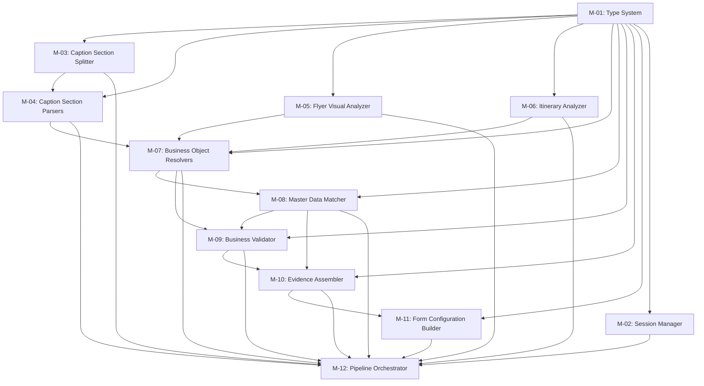

# EEOS Engineering Execution Plan — Generate Package Intelligence

**Status:** PENDING PO APPROVAL  
**Governance Standard:** EEOS Governance Baseline v1.2 (FROZEN)  
**EEOS Version:** v3.1.0  
**Project Scope:** Generate Package Intelligence (Package Creation Bot)  
**Role:** Chief Engineering Orchestrator  

---

## 1. Context Verification Report

### 1.1 Context Drift Check

| Check | Result |
|-------|--------|
| Project Scope Lock | ✅ Generate Package Intelligence ONLY |
| Architecture Drift | ✅ NONE — No new architecture introduced |
| Business Rule Drift | ✅ NONE — All rules from Package Creation Bot Constitution v1.2 |
| ADR Drift | ✅ NONE — No new ADR created |
| Module Drift | ✅ NONE — All 12 modules verified against approved Implementation Plan |
| Project Drift | ✅ NONE — No Master Configuration, Hotel, Route, or unrelated modules referenced |

### 1.2 Module Inventory Verification

All 12 modules confirmed present in the approved Implementation Plan:

| Module | Name | In Approved Plan? |
|--------|------|-------------------|
| M-01 | Type System | ✅ YES |
| M-02 | Session Manager | ✅ YES |
| M-03 | Caption Section Splitter | ✅ YES |
| M-04 | Caption Section Parsers | ✅ YES |
| M-05 | Flyer Visual Analyzer | ✅ YES |
| M-06 | Itinerary Analyzer | ✅ YES |
| M-07 | Business Object Resolvers | ✅ YES |
| M-08 | Master Data Matcher | ✅ YES |
| M-09 | Business Validator | ✅ YES |
| M-10 | Evidence Assembler | ✅ YES |
| M-11 | Form Configuration Builder | ✅ YES |
| M-12 | Pipeline Orchestrator | ✅ YES |

**No modules outside this list are referenced anywhere in this document.**

---

## 2. Baseline Verification

### 2.1 Immutable Baselines Read

| Baseline Document | Location | Status |
|-------------------|----------|--------|
| **Blueprint v2.0** (Package Creation Bot Constitution) | [package-creation-bot-constitution.md](file:///d:/Projects/app-admin-vtu/eeos/constitution/business/package-creation-bot-constitution.md) | ACCEPTED v1.2 — LOCKED |
| **PO Decision Document** | Embedded in Constitution Evidence Section (Phase 1 + Phase 2 PO Approval 2026-06-29) | LOCKED |
| **Business Rules** (R-01 to R-18) | [package-creation-bot-constitution.md#L174-L194](file:///d:/Projects/app-admin-vtu/eeos/constitution/business/package-creation-bot-constitution.md#L174-L194) | LOCKED |
| **ADR Catalog** | [adr-lifecycle-policy.md](file:///d:/Projects/app-admin-vtu/eeos/governance/adr-lifecycle-policy.md) | LOCKED |
| **Implementation Plan** | PO-Approved 12-Module Plan (M-01 to M-12) | LOCKED |

### 2.2 Supporting Constitutions (Read-Only References)

| Document | Location | Relevance |
|----------|----------|-----------|
| Raw + Mapped Value Contract | [raw-mapped-value-contract.md](file:///d:/Projects/app-admin-vtu/eeos/constitution/business/raw-mapped-value-contract.md) | Data Contract for M-01, M-10 |
| Pricing Mode Constitution | [pricing-mode-constitution.md](file:///d:/Projects/app-admin-vtu/eeos/constitution/business/pricing-mode-constitution.md) | Pricing rules for M-04, M-09 |
| AI Governance Constitution | [ai-governance.md](file:///d:/Projects/app-admin-vtu/eeos/constitution/ai/ai-governance.md) | AI boundary rules for M-05, M-06, M-12 |
| Human Review Constitution | [human-review-constitution.md](file:///d:/Projects/app-admin-vtu/eeos/constitution/ai/human-review-constitution.md) | Review workflow for M-11 |
| Confidence Framework | [confidence-framework.md](file:///d:/Projects/app-admin-vtu/eeos/constitution/ai/confidence-framework.md) | Confidence scoring for M-10 |

### 2.3 Business Engine Baselines (Read-Only References)

| Document | Location | Mapped Module |
|----------|----------|---------------|
| Alias Resolver | [alias-resolver.md](file:///d:/Projects/app-admin-vtu/eeos/business-engine/alias-resolver.md) | M-07, M-08 |
| Package Code Generator | [package-code-generator.md](file:///d:/Projects/app-admin-vtu/eeos/business-engine/package-code-generator.md) | M-07 |
| Completeness Calculator | [completeness-calculator.md](file:///d:/Projects/app-admin-vtu/eeos/business-engine/completeness-calculator.md) | M-09, M-10 |
| Date Normalizer | [date-normalizer.md](file:///d:/Projects/app-admin-vtu/eeos/business-engine/date-normalizer.md) | M-04 |
| Duration Calculator | [duration-calculator.md](file:///d:/Projects/app-admin-vtu/eeos/business-engine/duration-calculator.md) | M-04 |
| Package Type Classifier | [package-type-classifier.md](file:///d:/Projects/app-admin-vtu/eeos/business-engine/package-type-classifier.md) | M-07 |
| Landing Resolver | [landing-resolver.md](file:///d:/Projects/app-admin-vtu/eeos/business-engine/landing-resolver.md) | M-07 |

### 2.4 Existing Source Code Inventory

| File | Location | Current State |
|------|----------|---------------|
| types.ts | [types.ts](file:///d:/Projects/app-admin-vtu/src/server/services/package-ai/types.ts) | Phase 1 types — needs refactoring to M-01 Type System |
| index.ts | [index.ts](file:///d:/Projects/app-admin-vtu/src/server/services/package-ai/index.ts) | Monolithic orchestrator — needs decomposition to M-12 |
| caption-parser.ts | [caption-parser.ts](file:///d:/Projects/app-admin-vtu/src/server/services/package-ai/caption-parser.ts) | Monolithic parser — needs decomposition to M-03 + M-04 |
| gemini-extractor.ts | [gemini-extractor.ts](file:///d:/Projects/app-admin-vtu/src/server/services/package-ai/gemini-extractor.ts) | Gemini AI extractor — needs refactoring to M-05 |
| alias-resolver.ts | [alias-resolver.ts](file:///d:/Projects/app-admin-vtu/src/server/services/package-ai/alias-resolver.ts) | Hardcoded aliases — needs migration to M-07 + M-08 |
| package-builder.ts | [package-builder.ts](file:///d:/Projects/app-admin-vtu/src/server/services/package-ai/package-builder.ts) | Package builder — needs refactoring to M-07 |

### 2.5 Evidence Log

- **E-001**: [Package Creation Bot Constitution v1.2](file:///d:/Projects/app-admin-vtu/eeos/constitution/business/package-creation-bot-constitution.md) — 14 Principles, 18 Business Rules, 14 Business Events, 10 Business Exceptions, 12 Validations
- **E-002**: [Raw + Mapped Value Contract v1.0](file:///d:/Projects/app-admin-vtu/eeos/constitution/business/raw-mapped-value-contract.md) — Data Contract for field-level raw/mapped separation
- **E-003**: [AI Governance Constitution v1.0](file:///d:/Projects/app-admin-vtu/eeos/constitution/ai/ai-governance.md) — AI BOLEH/TIDAK BOLEH boundary
- **E-004**: [Confidence Framework v1.0](file:///d:/Projects/app-admin-vtu/eeos/constitution/ai/confidence-framework.md) — Per-field confidence scoring contract
- **E-005**: [Human Review Constitution v1.0](file:///d:/Projects/app-admin-vtu/eeos/constitution/ai/human-review-constitution.md) — Review workflow & mandatory scope
- **E-006**: [Existing Source Code](file:///d:/Projects/app-admin-vtu/src/server/services/package-ai/) — 6 files, Phase 1 implementation
- **E-007**: [7 Business Engine Documents](file:///d:/Projects/app-admin-vtu/eeos/business-engine/) — Resolver, Calculator, Classifier, Normalizer, Generator
- **E-008**: [Implementation Compliance Gate](file:///d:/Projects/app-admin-vtu/eeos/governance/implementation-compliance-gate.md) — 8-stage compliance pipeline

**Evidence Tier:** Tier 1 (Official EEOS Constitution + Production Source Code)  
**Confidence Level:** CONFIRMED  

---

## 3. Dependency DAG



### Dependency Matrix

| Module | Depends On | Depended By |
|--------|-----------|-------------|
| **M-01** Type System | — (ROOT) | ALL (M-02 to M-12) |
| **M-02** Session Manager | M-01 | M-12 |
| **M-03** Caption Section Splitter | M-01 | M-04, M-12 |
| **M-04** Caption Section Parsers | M-01, M-03 | M-07, M-12 |
| **M-05** Flyer Visual Analyzer | M-01 | M-07, M-12 |
| **M-06** Itinerary Analyzer | M-01 | M-07, M-12 |
| **M-07** Business Object Resolvers | M-01, M-04, M-05, M-06 | M-08, M-09, M-12 |
| **M-08** Master Data Matcher | M-01, M-07 | M-09, M-10, M-12 |
| **M-09** Business Validator | M-01, M-07, M-08 | M-10, M-12 |
| **M-10** Evidence Assembler | M-01, M-08, M-09 | M-11, M-12 |
| **M-11** Form Configuration Builder | M-01, M-10 | M-12 |
| **M-12** Pipeline Orchestrator | M-01 to M-11 (ALL) | — (TERMINAL) |

---

## 4. Engineering Team Topology

### Team Structure

| Team | Name | Focus | Modules |
|------|------|-------|---------|
| **Alpha** | Foundation & Types | Type system, session lifecycle, shared interfaces | M-01, M-02 |
| **Beta** | Source Extraction | Caption splitting, section parsing, flyer visual, itinerary | M-03, M-04, M-05, M-06 |
| **Gamma** | Business Logic | Object resolution, master data matching, validation | M-07, M-08, M-09 |
| **Delta** | Output Assembly | Evidence assembly, form configuration | M-10, M-11 |
| **Epsilon** | Orchestration & Integration | Pipeline orchestration, integration testing | M-12 |

### Team Assignment Rationale

| Team | Why These Modules Together | Dependencies | Expected Output | Handoff Contract |
|------|---------------------------|-------------|-----------------|------------------|
| **Alpha** | M-01 is root dependency for ALL modules. M-02 manages session state that persists across the pipeline. Both are foundational and blocking. | None (root) | Frozen TypeScript interfaces, Session lifecycle API | Exported types from `types/` directory; `SessionManager` class with `create/get/update/complete` |
| **Beta** | M-03 to M-06 are all *source extraction* modules that read raw inputs (caption text, flyer image, itinerary image). They can be developed in parallel after M-01 ships, because M-03→M-04 is the only internal dependency. M-05 and M-06 are fully independent of each other. | M-01 | Per-section parsed data structures conforming to `ExtractionField` contract | Caption sections array; Parsed field arrays per section; Flyer visual extraction result; Itinerary structured result |
| **Gamma** | M-07 to M-09 form the *business intelligence* layer. Resolvers consume parser outputs (M-04, M-05, M-06), Matcher consumes resolved objects, Validator consumes both. Clean data flow. | M-01, M-04, M-05, M-06 | Resolved business objects, matched Master Data IDs, validation report | `ResolvedPackage` with mapped fields; `ValidationReport` with per-field pass/fail |
| **Delta** | M-10 and M-11 are the *output assembly* layer. Evidence Assembler consumes validated/matched data. Form Config Builder consumes evidence to produce UI form state. | M-01, M-08, M-09 | Evidence payload with full provenance; Form configuration JSON for Human Review UI | `EvidencePackage` with per-field confidence + source provenance; `FormConfig` with field layout + validation state |
| **Epsilon** | M-12 is the *terminal orchestrator* that wires all modules together through the 6-step Fusion Engine pipeline. It must be developed last. | ALL (M-01 to M-11) | Working end-to-end pipeline: Upload → OCR → Extract → Resolve → Validate → Draft | `PipelineOrchestrator` class conforming to Fusion Engine contract |

---

## 5. Parallel Execution Waves

```
Wave 1 (Foundation)          Wave 2 (Parallel Extraction)        Wave 3 (Business Logic)      Wave 4 (Assembly & Orchestration)
┌──────────────┐             ┌──────────────┐                    ┌──────────────┐              ┌──────────────┐
│ Team Alpha   │             │ Team Beta    │                    │ Team Gamma   │              │ Team Delta   │
│ M-01         │────────────►│ M-03 ──► M-04│───────────────────►│ M-07         │─────────────►│ M-10         │
│ M-02         │      │      │ M-05 (parallel)│          │       │ M-08         │       │      │ M-11         │
└──────────────┘      │      │ M-06 (parallel)│          │       │ M-09         │       │      └──────────────┘
                      │      └──────────────┘            │       └──────────────┘       │              │
                      │                                  │                              │              ▼
                      │                                  │                              │      ┌──────────────┐
                      │                                  │                              │      │ Team Epsilon │
                      │                                  │                              └─────►│ M-12         │
                      │                                  │                                     └──────────────┘
                      │                                  │
                      └──────────────────────────────────┘
```

### Wave 1: Foundation (BLOCKING — Must Complete First)

| Team | Module | Objective | Output |
|------|--------|-----------|--------|
| Alpha | **M-01** Type System | Define all TypeScript types, interfaces, enums for the entire pipeline | Frozen type exports |
| Alpha | **M-02** Session Manager | Implement session lifecycle (create, persist, retrieve, complete, discard) | `SessionManager` class |

**Gate 1 Criteria:** All types compile. Session Manager passes unit tests. Types are frozen and published for downstream teams.

### Wave 2: Parallel Source Extraction

| Team | Module | Objective | Parallelism |
|------|--------|-----------|-------------|
| Beta | **M-03** Caption Section Splitter | Split raw caption text into logical sections | Sequential (M-03 before M-04) |
| Beta | **M-04** Caption Section Parsers | Parse each section into structured fields (dates, prices, duration, airlines, hotels) | After M-03 |
| Beta | **M-05** Flyer Visual Analyzer | Extract structured data from flyer image via Gemini AI | **PARALLEL with M-03/M-04** |
| Beta | **M-06** Itinerary Analyzer | Extract structured itinerary (day-by-day city/hotel schedule) from itinerary image | **PARALLEL with M-03/M-04 and M-05** |

> [!IMPORTANT]
> M-05 and M-06 have **ZERO dependency on each other** and **ZERO dependency on M-03/M-04**. They only depend on M-01. All three extraction paths (Caption, Flyer Visual, Itinerary) can be developed simultaneously.

**Gate 2 Criteria:** Each extractor returns data conforming to M-01 type contracts. Unit tests pass for each parser with sample inputs.

### Wave 3: Business Logic

| Team | Module | Objective | Dependencies |
|------|--------|-----------|-------------|
| Gamma | **M-07** Business Object Resolvers | Resolve extracted raw values into business objects (Package Type, Landing, Airline, City) using Business Engine rules | M-04, M-05, M-06 outputs |
| Gamma | **M-08** Master Data Matcher | Match resolved objects to Master Data entries (Airlines, Hotels, Cities, Package Types) using Alias Resolver | M-07 output |
| Gamma | **M-09** Business Validator | Validate the complete package draft: mandatory field presence, format, range, conflict detection, completeness score | M-07, M-08 outputs |

> [!NOTE]
> Within Wave 3, M-07 must complete before M-08 and M-09. M-08 must complete (or at minimum expose its interface) before M-09 can validate Master Data mapping states.

**Gate 3 Criteria:** Resolvers produce correct business objects from test inputs. Matcher returns correct Master IDs (or NEED_MAPPING). Validator correctly blocks when mandatory fields are MISSING. Completeness Calculator matches formula F-03.

### Wave 4: Assembly & Orchestration

| Team | Module | Objective | Dependencies |
|------|--------|-----------|-------------|
| Delta | **M-10** Evidence Assembler | Assemble per-field evidence (rawValue, mappedValue, source, confidence, fieldStatus) into a complete evidence package | M-08, M-09 outputs |
| Delta | **M-11** Form Configuration Builder | Build UI form configuration with field layout, validation state, confidence visual indicators, review priority | M-10 output |
| Epsilon | **M-12** Pipeline Orchestrator | Wire all modules into the 6-step Fusion Engine pipeline: Collect → Normalize → Merge → Conflict Detection → Validation → Draft Package | ALL modules |

**Gate 4 Criteria:** Evidence package contains provenance for every field. Form config correctly highlights CONFLICT, NEED_REVIEW, NEED_MAPPING fields. Pipeline orchestrator executes the full flow and produces a valid PackageDraft.

---

## 6. Work Package Assignment

### Package A — Foundation (Team Alpha)

| WP | Module | Scope | Constitution Reference |
|----|--------|-------|----------------------|
| WP-A1 | M-01 | Define: `ExtractionField`, `FieldStatus`, `FieldSource`, `FieldCategory`, `FieldConfidence`, `PackageExtractionResult` (v2), `PackageDraft` (v2), `SessionState`, `ValidationResult`, `EvidenceField`, `FormFieldConfig` | R-06, R-07, R-08, R-09, R-13, R-14 |
| WP-A2 | M-02 | Implement `SessionManager`: create session from upload, persist extraction state, track draft lifecycle (DRAFT→REVIEW→READY→PUBLISHED→ARCHIVED) | Business States (L122-L148) |

### Package B — Source Extraction (Team Beta)

| WP | Module | Scope | Constitution Reference |
|----|--------|-------|----------------------|
| WP-B1 | M-03 | Split raw caption into logical sections: identity, transportation, pricing, hotel, include/exclude, duration, dates, promo | Fusion Engine Step 1: Source Collection |
| WP-B2 | M-04 | Per-section parsers: DateParser (DN-01 to DN-06), DurationParser (Duration Calculator), PriceParser, AirlineParser, HotelParser, IncludeExcludeParser | Business Formulas F-05, F-06; Business Engines |
| WP-B3 | M-05 | Refactor `gemini-extractor.ts` → structured Flyer Visual Analyzer with per-field confidence and source provenance | AI Governance: Extract, Normalize, Flag |
| WP-B4 | M-06 | Extract itinerary structure: day-by-day {day, city, activities, hotel} with landing city resolution | Data Extraction Contract I; Landing Resolver |

### Package C — Business Logic (Team Gamma)

| WP | Module | Scope | Constitution Reference |
|----|--------|-------|----------------------|
| WP-C1 | M-07 | Refactor `alias-resolver.ts` + `package-builder.ts` → Business Object Resolvers: PackageTypeClassifier, LandingResolver, AirlineResolver, CityResolver, PackageCodeGenerator | Business Engines: EEOS-ENG-001 to EEOS-ENG-007 |
| WP-C2 | M-08 | Implement Master Data Matcher: query Master Airlines/Hotels/Cities/PackageTypes, apply Alias Registry (AR-01 to AR-06), set field status MAPPED/NEED_MAPPING | Raw+Mapped Value Contract: R-RM-01 to R-RM-07 |
| WP-C3 | M-09 | Implement Business Validator: mandatory gate (V-04), format validation (V-05 to V-07), conflict detection (V-08), completeness calculation (CC-01 to CC-05), low confidence flagging (V-11) | Validation Catalog V-01 to V-12; Completeness Calculator |

### Package D — Output Assembly (Team Delta)

| WP | Module | Scope | Constitution Reference |
|----|--------|-------|----------------------|
| WP-D1 | M-10 | Assemble evidence per field: {rawValue, mappedValue, source, confidence, fieldStatus, confidenceFactors}. Calculate aggregate confidence (F-04). Record source provenance. | Confidence Framework; Raw+Mapped Value Contract; Principle 10 (Source Provenance) |
| WP-D2 | M-11 | Build form configuration for Human Review UI: field ordering by review priority (HR-01 to HR-09), confidence visual indicators (🔴🟠🟡🟢), field grouping by category (Mandatory/Recommended/Optional) | Human Review Constitution; Confidence Visual Guide |

### Package E — Integration (Team Epsilon)

| WP | Module | Scope | Constitution Reference |
|----|--------|-------|----------------------|
| WP-E1 | M-12 | Implement Pipeline Orchestrator as Fusion Engine: 6-step pipeline (Collect→Normalize→Merge→Conflict Detection→Validation→Draft Package). Wire M-02 through M-11. Handle multi-date split (R-02). Enforce validation-before-draft (R-13). | Fusion Engine Workflow; Principle 8; Business Events EVT-01 to EVT-14 |

---

## 7. Interface Freeze Matrix

> [!CAUTION]
> ALL interfaces below MUST be frozen by Team Alpha (M-01) before Wave 2 teams begin implementation. No team may modify another team's frozen interface.

### 7.1 Core Field Contract (Principle 5, 6, 8, 10, 13)

```typescript
// M-01: Field Source Provenance
type FieldSource = 'flyer_ocr' | 'caption' | 'itinerary_ocr' | 'master_suggest' | 'human_edit';

// M-01: Field Business Status (6-state machine)
type FieldStatus = 'MISSING' | 'EXTRACTED' | 'CONFLICT' | 'MAPPED' | 'NEED_REVIEW' | 'NEED_MAPPING' | 'VALIDATED';

// M-01: Field Category
type FieldCategory = 'MANDATORY' | 'RECOMMENDED' | 'OPTIONAL';

// M-01: Per-Field Extraction Contract
interface ExtractionField<T = string> {
  rawValue: T | null;
  mappedValue: string | null;          // Master Data ID (set by Human ONLY — R-RM-02)
  suggestedMapping: string | null;     // AI suggestion (R-RM-05)
  source: FieldSource;
  confidence: number;                  // 0.0 - 1.0
  confidenceFactors?: ConfidenceFactors;
  fieldStatus: FieldStatus;
  category: FieldCategory;
}

// M-01: Confidence Factors (Confidence Framework)
interface ConfidenceFactors {
  ocrQuality: number;       // 30% weight
  patternMatch: number;     // 40% weight
  sourceAgreement: number;  // 20% weight
  contextConsistency: number; // 10% weight
}
```

### 7.2 Extraction Result Contract (Data Extraction Contract A-J)

```typescript
// M-01: Package Extraction Result v2
interface PackageExtractionResultV2 {
  // Identity (Contract A)
  startingPoint: ExtractionField;
  packageType: ExtractionField;
  durationDays: ExtractionField<number>;
  programName: ExtractionField;

  // Departure (Contract B)
  departureDates: ExtractionField<string[]>;

  // Transportation (Contract C)
  airline: ExtractionField;
  landingCity: ExtractionField;
  landingRoute: ExtractionField;

  // Pricing (Contract D)
  pricingMode: ExtractionField<'SINGLE' | 'TIER'>;
  price: ExtractionField<number>;
  clusters?: ClusterExtraction[];

  // Hotel (Contract E)
  hotelMekkah: ExtractionField;
  hotelMadinah: ExtractionField;

  // Include/Exclude (Contract G, H)
  include: ExtractionField<string[]>;
  exclude: ExtractionField<string[]>;

  // Itinerary (Contract I)
  itineraryDraft: ExtractionField<ItineraryDay[]>;

  // Marketing (Contract J)
  promoText: ExtractionField;
  description: ExtractionField;
  notes: ExtractionField;

  // Perlengkapan (Contract F)
  perlengkapan: ExtractionField<string[]>;
}
```

### 7.3 Session Contract (Business States)

```typescript
// M-02: Draft Lifecycle
type DraftStatus = 'DRAFT' | 'REVIEW' | 'READY' | 'PUBLISHED' | 'ARCHIVED';

// M-02: Session State
interface PipelineSession {
  id: string;
  status: DraftStatus;
  flyerPath: string | null;
  itineraryPath: string | null;
  captionText: string | null;
  extractionResult: PackageExtractionResultV2 | null;
  validationReport: ValidationReport | null;
  evidencePackage: EvidencePackage | null;
  formConfig: FormConfig | null;
  reviewedBy: string | null;
  reviewedAt: Date | null;
  publishedPackageId: string | null;
  createdAt: Date;
  updatedAt: Date;
}
```

### 7.4 Validation Report Contract (V-01 to V-12)

```typescript
// M-09: Validation Report
interface ValidationReport {
  overallStatus: 'PASS' | 'FAIL';
  completenessScore: number;          // 0-100 (Formula F-03)
  aggregateConfidence: number;        // 0.0-1.0 (Formula F-04)
  mandatoryComplete: boolean;
  fieldValidations: FieldValidation[];
  conflicts: ConflictEntry[];
  blockers: string[];
  warnings: string[];
}

interface FieldValidation {
  fieldName: string;
  status: 'PASS' | 'FAIL' | 'WARNING';
  rule: string;                       // V-01 to V-12 reference
  message: string;
}

interface ConflictEntry {
  fieldName: string;
  sources: { source: FieldSource; value: unknown }[];
  resolution: 'PENDING' | 'HUMAN_RESOLVED';
}
```

### 7.5 Evidence Package Contract (Principle 10, Confidence Framework)

```typescript
// M-10: Evidence Package
interface EvidencePackage {
  sessionId: string;
  timestamp: Date;
  fields: Record<string, EvidenceField>;
  aggregateConfidence: number;
  completenessScore: number;
  sourceInventory: FieldSource[];
}

interface EvidenceField {
  rawValue: unknown;
  mappedValue: string | null;
  source: FieldSource;
  confidence: number;
  confidenceFactors: ConfidenceFactors;
  fieldStatus: FieldStatus;
  category: FieldCategory;
  validationResult: 'PASS' | 'FAIL' | 'WARNING' | null;
}
```

### 7.6 Form Configuration Contract (Human Review Constitution)

```typescript
// M-11: Form Configuration
interface FormConfig {
  sessionId: string;
  sections: FormSection[];
  reviewPriority: ReviewPriorityItem[];
}

interface FormSection {
  id: string;
  title: string;
  category: FieldCategory;
  fields: FormFieldConfig[];
}

interface FormFieldConfig {
  fieldName: string;
  label: string;
  type: 'text' | 'number' | 'date' | 'select' | 'multi-select' | 'array';
  value: unknown;
  rawValue: unknown;
  confidence: number;
  confidenceIndicator: '🟢' | '🟡' | '🟠' | '🔴';
  fieldStatus: FieldStatus;
  requiresReview: boolean;              // HR-01 to HR-06
  quickReview: boolean;                 // HR-07 to HR-09
  masterDataOptions?: { id: string; label: string }[];
  validationMessage?: string;
}

interface ReviewPriorityItem {
  fieldName: string;
  priority: 'HIGH' | 'MEDIUM' | 'LOW';
  reason: string;                       // HR-01 to HR-09 reference
}
```

### 7.7 Pipeline Contract (Fusion Engine)

```typescript
// M-12: Pipeline Orchestrator
interface PipelineInput {
  flyerImage: Buffer;
  itineraryImage?: Buffer;
  caption: string;
  userId: string;
}

interface PipelineOutput {
  session: PipelineSession;
  drafts: PackageDraft[];              // N drafts for N dates (R-02)
  formConfig: FormConfig;
  validationReport: ValidationReport;
  evidencePackage: EvidencePackage;
}

// 6-Step Fusion Engine Pipeline
type PipelineStep = 
  | 'COLLECT'
  | 'NORMALIZE'
  | 'MERGE'
  | 'CONFLICT_DETECT'
  | 'VALIDATE'
  | 'DRAFT_PACKAGE';
```

---

## 8. Merge Strategy

### Merge Order (Dependency-Driven)

```
1. M-01 (Type System)           → merge first (root dependency)
2. M-02 (Session Manager)       → merge second
3. M-03, M-05, M-06            → merge in parallel (independent)
4. M-04                         → merge after M-03
5. M-07                         → merge after M-04, M-05, M-06
6. M-08                         → merge after M-07
7. M-09                         → merge after M-07, M-08
8. M-10                         → merge after M-08, M-09
9. M-11                         → merge after M-10
10. M-12                        → merge last (terminal)
```

### Branch Strategy

| Branch | Purpose |
|--------|---------|
| `preview` | Main development branch (current) |
| `feat/gpi-m01-type-system` | M-01 feature branch |
| `feat/gpi-m02-session-manager` | M-02 feature branch |
| `feat/gpi-m03-caption-splitter` | M-03 feature branch |
| ... | One branch per module |
| `feat/gpi-m12-pipeline-orchestrator` | M-12 feature branch |

### Merge Rules

1. Every module branch merges into `preview` via PR.
2. PR requires: build passes (`npm run build`), zero TypeScript errors.
3. Module branch MUST NOT modify files owned by another module.
4. Conflict resolution: upstream module owner resolves.

---

## 9. Integration Strategy

### Integration Checkpoints

| Checkpoint | After Wave | What is Verified |
|-----------|-----------|-----------------|
| **IC-01** | Wave 1 | M-01 types compile and are importable by all modules. M-02 session lifecycle works end-to-end. |
| **IC-02** | Wave 2 | Caption parser + Flyer analyzer + Itinerary analyzer each produce output conforming to M-01 `ExtractionField` interface. |
| **IC-03** | Wave 3 | Resolvers correctly transform raw values to business objects. Matcher correctly queries Master Data. Validator correctly blocks on mandatory failures. |
| **IC-04** | Wave 4 | Evidence Assembler produces complete provenance chain. Form Config Builder produces correct Human Review layout. Pipeline Orchestrator executes full Fusion Engine flow. |

### Rollback Checkpoints

| Checkpoint | Trigger | Action |
|-----------|---------|--------|
| **RC-01** | M-01 type break | Revert M-01 branch. Notify all teams. |
| **RC-02** | Integration test failure at IC-02 | Isolate failing extractor. Other extractors continue. |
| **RC-03** | Business logic regression at IC-03 | Revert Gamma modules. Extraction modules unaffected. |
| **RC-04** | Pipeline failure at IC-04 | Debug in M-12 only. All upstream modules are stable. |

---

## 10. Quality Gates

### Gate G-01: Foundation Freeze (End of Wave 1)

- [ ] M-01 TypeScript interfaces compile with `strict: true`
- [ ] M-01 interfaces cover ALL fields in Data Extraction Contract A-J
- [ ] M-01 `FieldStatus` covers all 6 business states (MISSING, EXTRACTED, CONFLICT, MAPPED, NEED_REVIEW, VALIDATED) + NEED_MAPPING
- [ ] M-02 session lifecycle supports all 5 draft states (DRAFT, REVIEW, READY, PUBLISHED, ARCHIVED)
- [ ] M-02 valid state transitions enforced (Constitution L130-L136)
- [ ] Interface contracts frozen and distributed to Teams Beta, Gamma, Delta, Epsilon

### Gate G-02: Extraction Quality (End of Wave 2)

- [ ] M-03 correctly splits caption into ≥ 5 logical sections
- [ ] M-04 date parser handles all formats in Date Normalizer (DN-01 to DN-06)
- [ ] M-04 duration parser handles "X HARI" pattern (3-45 range)
- [ ] M-04 price parser extracts numeric values from "Rp X.XXX.XXX" format
- [ ] M-05 Gemini extractor returns per-field confidence (not global confidence=1)
- [ ] M-06 itinerary parser returns day-by-day structure with city identification
- [ ] ALL extractors populate `source` field with correct provenance
- [ ] Zero Business Truth violations (Principle 9: AI does not invent data)

### Gate G-03: Business Logic Integrity (End of Wave 3)

- [ ] M-07 Package Type Classifier matches rules PT-01 to PT-04
- [ ] M-07 Landing Resolver matches rules LR-01 to LR-04
- [ ] M-07 Alias Resolver matches rules AR-01 to AR-06
- [ ] M-08 Master Data queries use `status='ACTIVE'` filter
- [ ] M-08 sets `fieldStatus=NEED_MAPPING` when no Master match found (R-RM-03)
- [ ] M-08 sets `fieldStatus=MAPPED` when Master match confirmed (R-RM-04)
- [ ] M-08 populates `suggestedMapping` (not `mappedValue`) per R-RM-05
- [ ] M-09 blocks draft creation when mandatory fields MISSING (R-03, CC-01)
- [ ] M-09 blocks draft creation when completeness < 60% (CC-02)
- [ ] M-09 flags CONFLICT when two sources disagree (R-05, V-08)
- [ ] M-09 correctly calculates completeness score per formula F-03

### Gate G-04: Evidence & Output Quality (End of Wave 4)

- [ ] M-10 evidence package contains provenance for EVERY field
- [ ] M-10 confidence factors have 4 components per field (OCR Quality 30%, Pattern Match 40%, Source Agreement 20%, Context Consistency 10%)
- [ ] M-11 form config groups fields into Mandatory/Recommended/Optional sections
- [ ] M-11 correctly identifies HIGH priority review items (HR-01 to HR-06)
- [ ] M-11 confidence visual indicators match framework (🔴 < 0.5, 🟠 0.5-0.7, 🟡 0.7-0.9, 🟢 > 0.9)
- [ ] M-12 executes full 6-step Fusion Engine pipeline
- [ ] M-12 produces N drafts for N departure dates (R-02)
- [ ] M-12 enforces validation-before-draft (R-13)
- [ ] M-12 produces drafts in DRAFT status ONLY (R-01)
- [ ] Full pipeline build passes (`npm run build`)
- [ ] EEOS Compliance Review passes (zero violations)

---

## 11. Execution Checklist

- [ ] **Wave 1 — Foundation**
  - [ ] M-01: Define all TypeScript types and interfaces
  - [ ] M-01: Freeze interfaces and distribute to all teams
  - [ ] M-02: Implement SessionManager class
  - [ ] M-02: Unit test session lifecycle transitions
  - [ ] Gate G-01: Foundation Freeze verified

- [ ] **Wave 2 — Parallel Extraction**
  - [ ] M-03: Implement CaptionSectionSplitter
  - [ ] M-04: Implement per-section parsers (Date, Duration, Price, Airline, Hotel, Include/Exclude)
  - [ ] M-05: Refactor gemini-extractor → FlyerVisualAnalyzer with per-field confidence
  - [ ] M-06: Implement ItineraryAnalyzer with day-by-day structure
  - [ ] Gate G-02: Extraction Quality verified

- [ ] **Wave 3 — Business Logic**
  - [ ] M-07: Implement PackageTypeClassifier, LandingResolver, AirlineResolver, CityResolver
  - [ ] M-08: Implement MasterDataMatcher with Alias Registry queries
  - [ ] M-09: Implement BusinessValidator with mandatory gate + completeness calculator + conflict detection
  - [ ] Gate G-03: Business Logic Integrity verified

- [ ] **Wave 4 — Assembly & Orchestration**
  - [ ] M-10: Implement EvidenceAssembler with full provenance chain
  - [ ] M-11: Implement FormConfigBuilder with Human Review layout
  - [ ] M-12: Implement PipelineOrchestrator as Fusion Engine
  - [ ] Gate G-04: Evidence & Output Quality verified

- [ ] **Post-Wave — EEOS Compliance**
  - [ ] Implementation Compliance Gate Stage 5 (zero violations)
  - [ ] Architecture Review (zero regressions)
  - [ ] Full build passes on `preview` branch

---

## 12. Risk Register

| Risk ID | Risk | Severity | Probability | Mitigation |
|---------|------|----------|-------------|------------|
| **R-01** | M-01 type changes after Wave 1 freeze break downstream modules | HIGH | LOW | Strict interface freeze at Gate G-01. Any change requires Orchestrator approval + all-team notification. |
| **R-02** | Gemini API response format changes break M-05 | MEDIUM | MEDIUM | M-05 validates response schema before parsing. Fallback to regex parser (existing `caption-parser.ts`). |
| **R-03** | Master Data tables not yet populated for M-08 queries | MEDIUM | MEDIUM | M-08 uses graceful degradation: empty Master = all fields NEED_MAPPING. No hard failure. |
| **R-04** | Merge conflicts between parallel Wave 2 modules (M-03/M-04/M-05/M-06) | LOW | LOW | Modules operate on separate file paths. No shared mutable state. |
| **R-05** | M-12 integration reveals interface mismatch between upstream modules | MEDIUM | MEDIUM | IC-02 and IC-03 integration checkpoints catch mismatches early. M-12 starts after Wave 3 Gate passes. |
| **R-06** | Confidence score inconsistency across different extractors | MEDIUM | MEDIUM | M-01 freezes `ConfidenceFactors` interface. All extractors must populate all 4 factors. M-10 validates completeness. |
| **R-07** | In-memory draft storage (current `Map<>`) causes data loss on restart | HIGH | HIGH | M-02 Session Manager implements database persistence (Prisma). Replaces in-memory `draftStore`. |

---

## 13. Go / No-Go Recommendation

### Final Validation Matrix

| Validation | Status |
|------------|--------|
| ✅ No architecture drift | PASS — No new architecture introduced |
| ✅ No business rule drift | PASS — All rules from Constitution R-01 to R-18 |
| ✅ No ADR drift | PASS — No new ADR created |
| ✅ No module drift | PASS — Only M-01 to M-12 from approved plan |
| ✅ No project drift | PASS — Generate Package Intelligence ONLY |

### Readiness Assessment

| Criteria | Status |
|----------|--------|
| All 12 modules identified and scoped | ✅ |
| Dependency DAG validated (no circular dependencies) | ✅ |
| Interface contracts defined for all cross-module boundaries | ✅ |
| Parallel work packages identified (maximum parallelization in Wave 2) | ✅ |
| Quality gates defined for each wave | ✅ |
| Risk register with mitigations | ✅ |
| Merge strategy defined | ✅ |
| Integration checkpoints defined | ✅ |
| Traceability to Constitution, Business Rules, Business Engines | ✅ |
| EEOS Governance Baseline v1.2 compliance | ✅ |

### Evidence Summary

- **Evidence Collected**: E-001 to E-008 (Constitution, Contracts, Source Code, Governance)
- **Evidence Tier**: Tier 1 (Official EEOS Documents + Production Source Code)
- **Confidence Level**: CONFIRMED
- **Implementation Recommendation**: **Proceed Engineering Execution Plan — Wave 1 Launch**

---

### ✅ RECOMMENDATION: **GO FOR WAVE 1 EXECUTION**

All 5 Engineering Teams may begin work upon PO approval.

**Wave 1 is BLOCKING.** Team Alpha must complete M-01 and M-02 before Teams Beta, Gamma, Delta, and Epsilon can start their respective modules.

After Wave 1 completes and Gate G-01 passes, **Teams Beta (4 modules), Gamma, Delta** can execute in maximum parallelism as defined in the Execution Waves.
